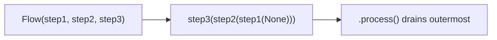

# Plan 02: Document dataflows Core Mechanics

<objective>
Fill in the "How dataflows Works" section of `ETL/DERIVE-FLOW-ANALYSIS.md` with a complete explanation of the dataflows framework: Flow() processor chaining, lazy pull-based evaluation, function auto-detection, checkpoint NDJSON caching with the "absorb" behavior, dump_to_path disk persistence, and all other key processors used in the derive pipeline (join, load, set_type, filter_rows, select_fields, etc.). This section is the foundation that readers need before they can understand the derive stages.
</objective>

<tasks>

<task id="01-02-01">
<title>Document Flow() and Processor Chaining</title>
<read_first>
- ETL/DERIVE-FLOW-ANALYSIS.md
- _analysis_temp/dataflows/dataflows/base/flow.py
- _analysis_temp/dataflows/dataflows/base/datastream.py
- .planning/phases/01-derive-flow-investigation/01-RESEARCH.md
</read_first>
<action>
Replace the `<!-- TODO: Fill in Plan 02 -->` placeholder under `## How dataflows Works` and `### Flow() and Processor Chaining` with content explaining:

**Under `## How dataflows Works`** — Add an introductory paragraph:
> `dataflows` (v0.5.5) is a Python data processing framework built on the Frictionless Data specification. It provides three core abstractions: **Flow** (pipeline builder), **DataStreamProcessor** (individual processing step), and **DataStream** (descriptor + resource iterators). The derive operator builds complex ETL pipelines using this framework.

**Under `### Flow() and Processor Chaining`** — Explain:
1. `Flow(*args)` stores steps as a tuple in `self.chain`
2. `.process()` calls `._chain()` which wraps each step around the previous DataStream
3. Each `DataStreamProcessor` receives an upstream DataStream and produces a new one
4. Nested `Flow` objects are flattened during chaining
5. Include a simplified code block showing `Flow.__init__`, `_chain()`, and `DataStreamProcessor._process()` — use the actual source patterns from `flow.py`
6. Include a Mermaid diagram showing the wrapping pattern:



Explain that this is a **decorator/wrapper pattern**, not a push-based event system.
</action>
<acceptance_criteria>
- The `## How dataflows Works` section contains the text "Python data processing framework"
- The `### Flow() and Processor Chaining` section contains a code block with `class Flow` or `def _chain`
- The section contains the word "decorator" or "wrapper pattern"
- The section contains a Mermaid diagram (text ````mermaid` appears in this section)
- The placeholder `<!-- TODO: Fill in Plan 02 -->` no longer appears under `## How dataflows Works`
- The placeholder `<!-- TODO: Fill in Plan 02 -->` no longer appears under `### Flow() and Processor Chaining`
</acceptance_criteria>
</task>

<task id="01-02-02">
<title>Document Lazy Evaluation and Pull-Based Execution</title>
<read_first>
- ETL/DERIVE-FLOW-ANALYSIS.md
- _analysis_temp/dataflows/dataflows/base/datastream.py
- .planning/phases/01-derive-flow-investigation/01-RESEARCH.md
</read_first>
<action>
Replace the `<!-- TODO: Fill in Plan 02 -->` placeholder under `### Lazy Evaluation and Pull-Based Execution` with:

1. Explain `LazyIterator` — stores a function that creates an iterator, only called when iteration begins
2. Explain the pull model: the terminal consumer (`.process()`, `dump_to_path`, `checkpoint`) starts iterating → pulls data from outer processor → which pulls from its upstream → all the way to the innermost source
3. Emphasize: **no work is done until a terminal consumer reads rows**
4. Explain what "draining" means: `.process()` iterates through all rows silently, triggering the full chain
5. State that this is why derive can define large pipelines cheaply — definition is O(1), execution is deferred

Include a numbered execution sequence:
```
1. .process() calls outermost processor._process()
2. Outermost calls self.source._process() → gets upstream DataStream
3. Recursion continues to innermost (or None → empty DataStream)
4. Each processor wraps resource iterators with its logic via LazyIterator
5. Outermost starts iterating → pulls rows through the entire chain
```
</action>
<acceptance_criteria>
- Section `### Lazy Evaluation and Pull-Based Execution` contains "LazyIterator"
- Section contains "pull" (describing pull-based model)
- Section contains a numbered list with at least 4 items describing the execution sequence
- The placeholder `<!-- TODO: Fill in Plan 02 -->` no longer appears under this heading
</acceptance_criteria>
</task>

<task id="01-02-03">
<title>Document Function Auto-Detection</title>
<read_first>
- ETL/DERIVE-FLOW-ANALYSIS.md
- _analysis_temp/dataflows/dataflows/base/flow.py
- .planning/phases/01-derive-flow-investigation/01-RESEARCH.md
</read_first>
<action>
Replace the `<!-- TODO: Fill in Plan 02 -->` placeholder under `### Function Auto-Detection` with:

Explain that when a bare Python function is passed to `Flow()`, dataflows inspects its parameter name to determine behavior. Include this exact table:

| Parameter Name | Behavior | Example |
|---------------|----------|---------|
| `row` | Called once per row, should return modified row or `None` to filter | `def add_field(row): row['x'] = 1` |
| `rows` | Receives a generator of all rows in a resource, must yield rows | `def dedup(rows): seen = set(); ...` |
| `package` | Receives the `PackageWrapper`, can modify schema/metadata | `def add_resource(package): ...` |

State that this is why derive code freely mixes `DF.*` processor calls with plain functions — they are all valid Flow steps. The auto-detection is based on the first parameter's **name**, not its type annotation.
</action>
<acceptance_criteria>
- Section `### Function Auto-Detection` contains a markdown table with columns "Parameter Name" and "Behavior"
- Table includes rows for `row`, `rows`, and `package`
- Section mentions "parameter name" or "signature" as the detection mechanism
- The placeholder `<!-- TODO: Fill in Plan 02 -->` no longer appears under this heading
</acceptance_criteria>
</task>

<task id="01-02-04">
<title>Document checkpoint vs dump_to_path</title>
<read_first>
- ETL/DERIVE-FLOW-ANALYSIS.md
- _analysis_temp/dataflows/dataflows/processors/checkpoint.py
- .planning/phases/01-derive-flow-investigation/01-RESEARCH.md
</read_first>
<action>
Replace the `<!-- TODO: Fill in Plan 02 -->` placeholder under `### checkpoint vs dump_to_path` with:

**checkpoint section:**
1. `checkpoint` is a `Flow` subclass that intercepts chain-building via `_preprocess_chain()`
2. Cache HIT: replaces entire upstream chain with `unstream(filename)` — reads NDJSON file, skips all upstream processing
3. Cache MISS: appends `stream(filename)` after upstream chain — data passes through AND gets serialized to `.checkpoints/<name>/stream.ndjson`
4. **Critical "absorb" behavior**: `handle_flow_checkpoint()` — when a checkpoint is inside a `Flow()`, it absorbs ALL preceding steps into its own chain. This means the checkpoint captures everything before it as upstream, not just the immediately preceding step
5. Cache invalidation is **manual only** — derive code uses `shutil.rmtree()` to delete checkpoint dirs before running
6. In the derive codebase, checkpoints are always deleted before use, so they effectively never cache-hit during normal operation. They serve as debugging/restart aids only.

**dump_to_path section:**
1. Writes all resources to disk as CSV files + `datapackage.json` descriptor
2. Always writes (no cache-hit shortcut)
3. Output is a standard Frictionless Data Package
4. Can be loaded back with `DF.load('path/datapackage.json')`
5. In derive, serves as **inter-sub-flow communication**: sub-flow N dumps → sub-flow N+1 loads

**Comparison table:**

| Aspect | `checkpoint` | `dump_to_path` |
|--------|-------------|----------------|
| Format | NDJSON (stream.ndjson) | CSV + datapackage.json |
| Cache behavior | Skips upstream on hit | Always writes |
| Absorbs upstream? | Yes (`handle_flow_checkpoint`) | No |
| Use in derive | 3 locations, always pre-deleted | 12 locations, inter-stage comms |
| Invalidation | Manual `shutil.rmtree()` | Overwritten each run |
</action>
<acceptance_criteria>
- Section `### checkpoint vs dump_to_path` contains the word "absorb" (describing handle_flow_checkpoint)
- Section contains "NDJSON" (checkpoint format)
- Section contains "handle_flow_checkpoint" (the method name)
- Section contains a comparison table with at least 4 rows
- Section mentions "shutil.rmtree" as the invalidation mechanism
- The placeholder `<!-- TODO: Fill in Plan 02 -->` no longer appears under this heading
</acceptance_criteria>
</task>

<task id="01-02-05">
<title>Document Other Key Processors</title>
<read_first>
- ETL/DERIVE-FLOW-ANALYSIS.md
- _analysis_temp/dataflows/dataflows/processors/__init__.py
- .planning/phases/01-derive-flow-investigation/01-RESEARCH.md
</read_first>
<action>
Replace the `<!-- TODO: Fill in Plan 02 -->` placeholder under `### Other Key Processors` with a reference table of all `DF.*` processor types used in the derive pipeline. Include every processor listed below with a one-line description of what it does:

| Processor | What It Does |
|-----------|-------------|
| `DF.load(path)` | Loads a previously-dumped data package from disk into the flow as new resources |
| `DF.dump_to_path(path)` | Writes all resources to disk as CSV files + datapackage.json |
| `DF.checkpoint(name)` | NDJSON cache — skips upstream on cache hit, writes through on miss |
| `DF.join(source, source_key, target, target_key, fields)` | SQL-like join: consumes source resource into memory, looks up matches for target rows |
| `DF.join_with_self(resource, key, fields)` | Self-join: groups rows by key within a single resource, applying aggregations |
| `DF.set_type(field, type, transform)` | Modifies field schema type and optionally applies a per-value transform function |
| `DF.filter_rows(condition, resources)` | Passes only rows where the predicate function returns True |
| `DF.select_fields(fields)` | Keeps only the listed fields, removes all others from data and schema |
| `DF.delete_fields(fields)` | Removes listed fields from data and schema |
| `DF.update_resource(name, **props)` | Modifies resource metadata (name, path, title) |
| `DF.update_package(**props)` | Modifies package metadata |
| `DF.validate()` | Validates all rows against current schema, raises on type mismatch |
| `DF.sort_rows(key)` | Sorts resource rows by a key expression |
| `DF.add_field(name, type, default)` | Adds a new field to the schema and optionally sets a default/computed value |
| `DF.finalizer(callback)` | Registers a callback that runs after all resources are fully consumed |

For `DF.join`, add a note: "The `fields` dict specifies which source fields to pull onto target rows, with optional aggregation: `count`, `sum`, `set`, `array`, `first`, etc."

For `DF.finalizer`, add a note: "Used in `es_utils.py` to delete old ES documents after new ones are loaded."
</action>
<acceptance_criteria>
- Section `### Other Key Processors` contains a markdown table with at least 14 rows
- Table includes entries for: `DF.load`, `DF.join`, `DF.join_with_self`, `DF.set_type`, `DF.filter_rows`, `DF.checkpoint`, `DF.dump_to_path`, `DF.finalizer`
- Section mentions "aggregation" in the context of DF.join
- The placeholder `<!-- TODO: Fill in Plan 02 -->` no longer appears under this heading
</acceptance_criteria>
</task>

</tasks>

<verification>
- `grep -c "TODO: Fill in Plan 02" ETL/DERIVE-FLOW-ANALYSIS.md` returns 0 (all Plan 02 placeholders filled)
- `grep "LazyIterator" ETL/DERIVE-FLOW-ANALYSIS.md` returns at least 1 match
- `grep "handle_flow_checkpoint" ETL/DERIVE-FLOW-ANALYSIS.md` returns at least 1 match
- `grep "NDJSON" ETL/DERIVE-FLOW-ANALYSIS.md` returns at least 1 match
- `grep -c "DF\." ETL/DERIVE-FLOW-ANALYSIS.md` returns at least 14 (all processor types documented)
- The "How dataflows Works" section spans at least 80 lines of content
</verification>

<must_haves>
- A reader unfamiliar with dataflows can understand Flow(), lazy evaluation, and processor chaining after reading this section
- The checkpoint "absorb" behavior (handle_flow_checkpoint) is explicitly explained — this is the biggest gotcha
- The difference between checkpoint and dump_to_path is clearly contrasted with a comparison table
- Every DF.* processor type used anywhere in the derive codebase has a reference entry
- Function auto-detection (row/rows/package parameter naming) is documented with a table
</must_haves>
