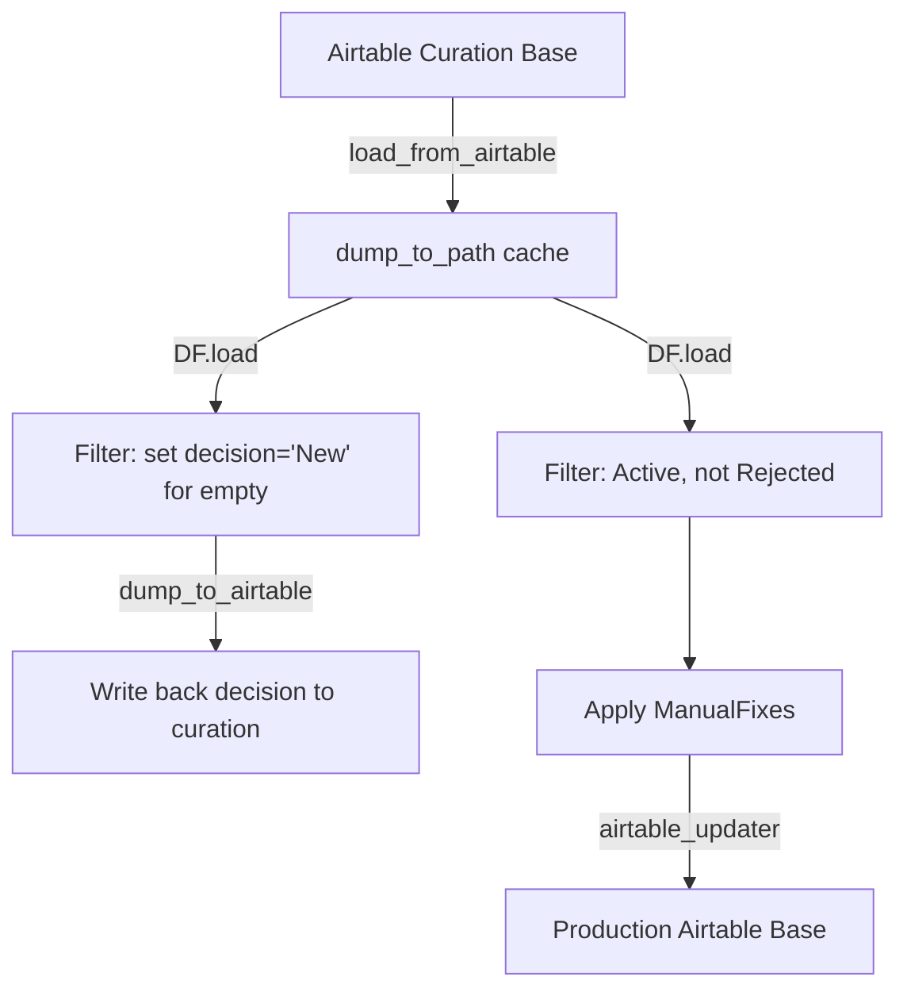
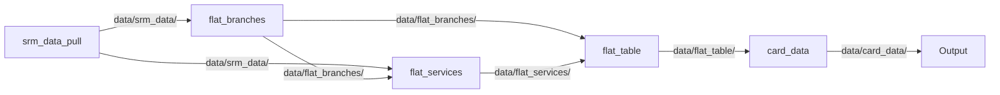
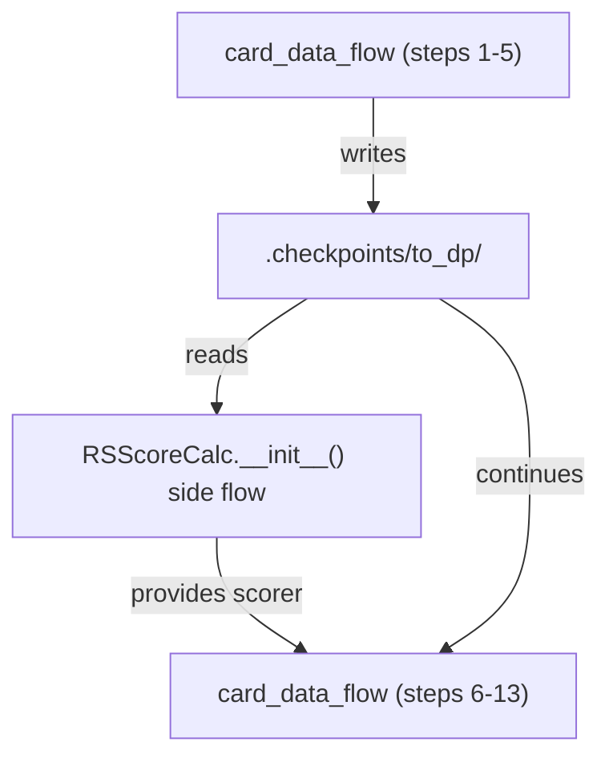

# Plan 03: Document Derive Stages 1–3 (from_curation, to_dp, autocomplete)

<objective>
Fill in the "Derive Overview", "Stage 1: from_curation", "Stage 2: to_dp" (all 5 sub-flows + RSScoreCalc), and "Stage 3: autocomplete" sections of `ETL/DERIVE-FLOW-ANALYSIS.md`. This covers the entry point orchestration, the complete `__main__.py` execution flow, the three most complex stages, and multi-step processing within to_dp's nested sub-flows. Each DF.* call gets a contextual explanation per decision D-05. Mermaid diagrams for high-level flows, ASCII for dense inline detail per decision D-04.
</objective>

<tasks>

<task id="01-03-01">
<title>Document Derive Overview and Entry Point</title>
<read_first>
- ETL/DERIVE-FLOW-ANALYSIS.md
- ETL/data/plugins/srm-etl/operators/derive/__main__.py
- ETL/data/plugins/srm-etl/operators/derive/__init__.py
- .planning/phases/01-derive-flow-investigation/01-RESEARCH.md
</read_first>
<action>
Replace the `<!-- TODO: Fill in Plan 03 -->` placeholders under `## Derive Overview` and `### Entry Point and Orchestration` with:

**Under `## Derive Overview`:**
One paragraph summarizing: The derive operator transforms data from an Airtable curation base into Elasticsearch indexes and Airtable card records. It runs 5 sequential stages: `from_curation` → `to_dp` → `autocomplete` → `to_es` → `to_sql`. Each stage is a separate Python module that builds and executes one or more dataflows `Flow()` pipelines. No stage runs in parallel — each must complete before the next begins.

**Under `### Entry Point and Orchestration`:**

1. Show `__main__.py` content (3 lines — it just calls `deriveData()`)
2. Show `__init__.py`'s `deriveData()` function — the 5 sequential calls with `invoke_on` wrapper
3. Explain that `invoke_on` is a try/except wrapper from `srm_tools.error_notifier` that sends an email notification on failure
4. Explain that each `*.operator()` call builds and fully executes one or more `Flow().process()` pipelines before returning
5. Note that `sys.setrecursionlimit(5000)` is set in `to_dp.py` because deeply nested Flow chains can exceed Python's default recursion limit

Include the exact function signatures and calls as they appear in the source files.
</action>
<acceptance_criteria>
- `## Derive Overview` section contains "5 sequential stages"
- `### Entry Point and Orchestration` section contains `deriveData` function content
- Section contains `invoke_on` explanation
- Section contains `__main__.py` content or description of it calling `deriveData()`
- Section mentions `sys.setrecursionlimit` or "recursion limit"
- The placeholder `<!-- TODO: Fill in Plan 03 -->` no longer appears under `## Derive Overview` or `### Entry Point and Orchestration`
</acceptance_criteria>
</task>

<task id="01-03-02">
<title>Document Stage 1: from_curation</title>
<read_first>
- ETL/DERIVE-FLOW-ANALYSIS.md
- ETL/data/plugins/srm-etl/operators/derive/from_curation.py
- ETL/data/plugins/srm-etl/operators/derive/manual_fixes.py
- .planning/phases/01-derive-flow-investigation/01-RESEARCH.md
</read_first>
<action>
Replace the `<!-- TODO: Fill in Plan 03 -->` placeholder under `## Stage 1: from_curation — Data Import` with:

1. **Purpose paragraph**: Copies Organizations, Branches, and Services records from the Airtable curation base to the production Airtable base. Applies manual fixes and filters (active, not rejected/suspended, has services).

2. **Flow diagram** (Mermaid):


3. **Step-by-step walkthrough** for each of the 3 tables (Organizations, Branches, Services):
   - `shutil.rmtree()` deletes previous cache for this table
   - `load_from_airtable` pulls all records from curation base
   - `dump_to_path(f'.checkpoints/from-curation-{table}/')` caches to disk
   - Filter rows without `decision` field, set decision to "New", write back to curation
   - Reload from cache (not from Airtable again — this is a key optimization)
   - Apply filters: `status == 'Active'`, decision not in `['Rejected', 'Suspended']`, org has services
   - Apply `ManualFixes` class — loads correction rules from Airtable, applies field-level overrides
   - Write to production base via `airtable_updater` (hash-based diff, writes only changed records)

4. **Cache locations**: List the 3 `dump_to_path` caches:
   - `.checkpoints/from-curation-Organizations/`
   - `.checkpoints/from-curation-Branches/`
   - `.checkpoints/from-curation-Services/`

5. Document every `DF.*` call in `from_curation.py` with a one-line explanation of what it does in this context (per D-05). Group repeated patterns (the 3 tables follow the same pattern).
</action>
<acceptance_criteria>
- Section `## Stage 1: from_curation` contains "Organizations, Branches, and Services"
- Section contains a Mermaid diagram (````mermaid` block)
- Section mentions `ManualFixes` class
- Section mentions `airtable_updater` and "hash-based diff" or "changed records"
- Section lists all 3 cache paths: `from-curation-Organizations`, `from-curation-Branches`, `from-curation-Services`
- Section contains `shutil.rmtree` as the cache invalidation mechanism
- The placeholder `<!-- TODO: Fill in Plan 03 -->` no longer appears under this heading
</acceptance_criteria>
</task>

<task id="01-03-03">
<title>Document Stage 2: to_dp overview and sub-flows 1-2</title>
<read_first>
- ETL/DERIVE-FLOW-ANALYSIS.md
- ETL/data/plugins/srm-etl/operators/derive/to_dp.py
- ETL/data/plugins/srm-etl/operators/derive/helpers.py
- .planning/phases/01-derive-flow-investigation/01-RESEARCH.md
</read_first>
<action>
Replace the `<!-- TODO: Fill in Plan 03 -->` placeholder under `## Stage 2: to_dp — Core Data Transformation` and fill in `### Sub-flow 1: srm_data_pull` and `### Sub-flow 2: flat_branches` with:

**Under `## Stage 2: to_dp`:**
1. Purpose: Transforms raw Airtable data into a denormalized "card data" format suitable for ES indexing. 946 lines, the largest and most complex derive module.
2. Show the `operator()` entry point: the cleanup code that deletes all checkpoints and intermediate directories, then calls the 5 sub-flows in order.
3. List the 5 sub-flows with one-line descriptions:
   - `srm_data_pull_flow()` — Pull and preprocess all Airtable tables
   - `flat_branches_flow(branch_mapping)` — Denormalize branches with org+location data
   - `flat_services_flow(branch_mapping)` — Denormalize services with branch data
   - `flat_table_flow()` — Join into final flat service-branch pairs
   - `card_data_flow()` — Enrich with taxonomy, scoring, autocomplete, address parsing
4. Include a Mermaid diagram showing the 5 sub-flows as a pipeline:

5. Explain the `branch_mapping` dict passed between sub-flows 2 and 3 (in-memory state shared via the Python dict reference).

**Under `### Sub-flow 1: srm_data_pull`:**
Walk through `srm_data_pull_flow()` step by step:
1. Loads 6 Airtable tables: Responses, Situations, Organizations, Locations, Branches, Services
2. `DF.checkpoint('srm_raw_airtable_buffer')` — caches all raw Airtable data (absorbs the 6 loads)
3. Calls `helpers.preprocess_responses()`, `helpers.preprocess_situations()`, `helpers.preprocess_services()`, `helpers.preprocess_organizations()`, `helpers.preprocess_branches()`, `helpers.preprocess_locations()` — each applies table-specific cleaning and field extraction
4. `DF.dump_to_path('data/srm_data')` — writes all 6 preprocessed tables to disk
Document every DF.* call with a one-line contextual explanation.

**Under `### Sub-flow 2: flat_branches`:**
Walk through `flat_branches_flow(branch_mapping)` step by step:
1. `DF.load('data/srm_data/datapackage.json', resources=['branches', 'locations', 'organizations'])`
2. Join locations onto branches (by location key)
3. Join organizations onto branches (by org key)
4. Merge duplicate branches (same org + geometry + name) using the consuming-generator pattern (breaks streaming, buffers all rows in memory)
5. Populate `branch_mapping` dict — maps old branch IDs to merged IDs
6. `DF.dump_to_path('data/flat_branches')`
Document every DF.* call with a one-line contextual explanation. Note the memory implications of merge_duplicate_branches.
</action>
<acceptance_criteria>
- `## Stage 2: to_dp` section contains "946 lines" or "largest"
- Section contains a Mermaid diagram with 5 sub-flow nodes
- Section lists all 5 sub-flow names: `srm_data_pull`, `flat_branches`, `flat_services`, `flat_table`, `card_data`
- `### Sub-flow 1: srm_data_pull` contains `checkpoint('srm_raw_airtable_buffer')` or `srm_raw_airtable_buffer`
- `### Sub-flow 1` mentions all 6 Airtable table names: Responses, Situations, Organizations, Locations, Branches, Services
- `### Sub-flow 2: flat_branches` contains `branch_mapping`
- `### Sub-flow 2` mentions "merge duplicate" or "deduplication"
- The placeholders under `## Stage 2`, `### Sub-flow 1`, and `### Sub-flow 2` are all replaced
</acceptance_criteria>
</task>

<task id="01-03-04">
<title>Document Stage 2 sub-flows 3-5 and RSScoreCalc</title>
<read_first>
- ETL/DERIVE-FLOW-ANALYSIS.md
- ETL/data/plugins/srm-etl/operators/derive/to_dp.py
- ETL/data/plugins/srm-etl/operators/derive/autotagging.py
- .planning/phases/01-derive-flow-investigation/01-RESEARCH.md
</read_first>
<action>
Replace the `<!-- TODO: Fill in Plan 03 -->` placeholders under `### Sub-flow 3: flat_services`, `### Sub-flow 4: flat_table`, `### Sub-flow 5: card_data`, and `### RSScoreCalc — Side-Channel Flow` with:

**Under `### Sub-flow 3: flat_services`:**
Walk through `flat_services_flow(branch_mapping)`:
1. Load flat_branches and srm_data/services
2. Unwind organization branches (one-to-many: a service with multiple org branches becomes multiple rows)
3. Join branches onto services using branch keys
4. Apply branch_mapping to redirect merged branch IDs
5. Merge direct branches + org branches
6. Unwind by branch_key — final expansion to one row per (service, branch) pair
7. Deduplicate services that implement other services
8. `DF.dump_to_path('data/flat_services')`
Document every DF.* call with a one-line contextual explanation.

**Under `### Sub-flow 4: flat_table`:**
Walk through `flat_table_flow()`:
1. Load flat_branches and flat_services
2. Join flat_branches onto flat_services by branch key — produces fully denormalized rows
3. Deduplicate (join_with_self on service+branch keys)
4. `DF.dump_to_path('data/flat_table')`
This is the simplest sub-flow — its purpose is to produce the final joined table. Document every DF.* call.

**Under `### Sub-flow 5: card_data`:**
Walk through `card_data_flow()` — the most complex sub-flow. Use **ASCII format** for the dense inline step list (per D-04, ASCII for dense inline details):

```
card_data_flow() steps:
─────────────────────
 1. DF.load('data/flat_table/datapackage.json')
 2. Generate card_id (hash of service_id + branch_id)
 3. merge_duplicate_services — buffer all rows, dedup by card_id
 4. Map taxonomy IDs — resolve response/situation references
 5. auto_tagging() — apply keyword-based tagging rules from Airtable
    ── checkpoint('to_dp') SPLITS HERE ──
 6. Add situations/responses as structured objects
 7. RSScoreCalc — compute relevance scores (side-channel flow)
 8. Add parent taxonomy IDs
 9. Generate possible autocomplete values
10. Compute location-based fields
11. Parse address_parts
12. Parse org_name_parts
13. DF.dump_to_path('data/card_data')
```

Explain the critical checkpoint split: `checkpoint('to_dp')` absorbs steps 1-5, so on cache hit steps 1-5 are skipped and only 6-13 execute. On cache miss (normal operation since the checkpoint is always pre-deleted), all 13 steps execute.

Document every DF.* call with a one-line contextual explanation. For complex steps like auto_tagging, explain what it does: loads rules from Airtable, applies keyword matching against org name/purpose/service name, adds matching situation/response IDs.

**Under `### RSScoreCalc — Side-Channel Flow`:**
1. Explain this is a **flow-within-a-flow** pattern — unusual and important to highlight
2. `RSScoreCalc.__init__` runs a *separate* `DF.Flow` that reads from the `to_dp` checkpoint
3. This side flow computes per-response and per-situation frequencies (count of cards per taxonomy term)
4. Once computed, the scorer provides a function that the main card_data_flow uses to assign relevance scores to each card
5. The side flow MUST run after the `to_dp` checkpoint has been written — this is why the checkpoint exists in the middle of card_data_flow
6. Include a Mermaid diagram:

</action>
<acceptance_criteria>
- `### Sub-flow 3: flat_services` contains "unwind" and "branch_mapping"
- `### Sub-flow 4: flat_table` contains "join" and mentions it's the simplest sub-flow
- `### Sub-flow 5: card_data` contains the ASCII step list with at least 10 numbered steps
- `### Sub-flow 5` mentions `checkpoint('to_dp')` and "absorbs"
- `### RSScoreCalc` contains "flow-within-a-flow" or "side-channel"
- `### RSScoreCalc` contains a Mermaid diagram
- `### RSScoreCalc` mentions "per-response" or "per-situation" frequencies
- All 4 placeholders under these headings are replaced
</acceptance_criteria>
</task>

<task id="01-03-05">
<title>Document Stage 3: autocomplete</title>
<read_first>
- ETL/DERIVE-FLOW-ANALYSIS.md
- ETL/data/plugins/srm-etl/operators/derive/autocomplete.py
- .planning/phases/01-derive-flow-investigation/01-RESEARCH.md
</read_first>
<action>
Replace the `<!-- TODO: Fill in Plan 03 -->` placeholder under `## Stage 3: autocomplete — Autocomplete Generation` with:

1. **Purpose**: Generate search autocomplete suggestions by combining response names, situation names, organization names, and cities using template patterns. Produces a deduplicated, scored list.

2. **Flow walkthrough**:
   - Load card_data from `data/card_data/`
   - `unwind_templates()` — Cartesian product generator: each card row expands into many autocomplete entries (combinations of templates × responses × situations × orgs × cities). Note: this is the most memory/compute-intensive operation per row.
   - Deduplicate autocomplete entries
   - Score entries (by frequency / specificity)
   - `DF.dump_to_path('data/autocomplete')`

3. Document every DF.* call with a one-line contextual explanation.

4. **Cache location**: `data/autocomplete/` — implicitly overwritten each run (no explicit `shutil.rmtree()`).

5. Note that the autocomplete output is later loaded by `to_es.py` for indexing into Elasticsearch.
</action>
<acceptance_criteria>
- Section `## Stage 3: autocomplete` contains "template" or "Cartesian product"
- Section mentions "response names, situation names, organization names" or similar
- Section mentions `data/autocomplete/` as the output path
- Section mentions the output is consumed by `to_es.py`
- The placeholder `<!-- TODO: Fill in Plan 03 -->` no longer appears under this heading
</acceptance_criteria>
</task>

</tasks>

<verification>
- `grep -c "TODO: Fill in Plan 03" ETL/DERIVE-FLOW-ANALYSIS.md` returns 0
- `grep "srm_data_pull" ETL/DERIVE-FLOW-ANALYSIS.md` returns at least 2 matches
- `grep "flat_branches" ETL/DERIVE-FLOW-ANALYSIS.md` returns at least 3 matches
- `grep "RSScoreCalc" ETL/DERIVE-FLOW-ANALYSIS.md` returns at least 2 matches
- `grep "auto_tagging" ETL/DERIVE-FLOW-ANALYSIS.md` returns at least 1 match
- `grep "Cartesian\|unwind_templates" ETL/DERIVE-FLOW-ANALYSIS.md` returns at least 1 match
- The Stage 1, Stage 2, and Stage 3 sections each contain at least 30 lines of content
</verification>

<must_haves>
- The complete __main__.py → __init__.py → 5 stages execution path is documented (ANLYS-03)
- All derive sub-modules covered by this plan have their role documented (ANLYS-04 partial)
- The 5 sub-flows within to_dp are individually documented with step-by-step walkthroughs (ANLYS-05 partial)
- Every DF.* call in from_curation.py, to_dp.py, and autocomplete.py has a contextual explanation (D-05)
- The checkpoint "absorb" behavior is re-explained in context of to_dp's card_data_flow
- RSScoreCalc's flow-within-a-flow pattern is highlighted as an unusual and important design choice
- Mermaid diagrams are used for high-level flows; ASCII for dense step lists (D-04)
</must_haves>
