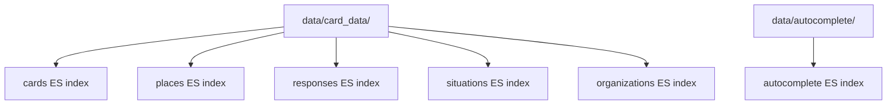

# Plan 04: Document Derive Stages 4–5 + Helper Modules + External Dependencies

<objective>
Fill in the "Stage 4: to_es", "Stage 5: to_sql", "Helper Modules" (helpers.py, autotagging.py, es_schemas.py, es_utils.py, manual_fixes.py), and "External Dependencies Reference" sections of `ETL/DERIVE-FLOW-ANALYSIS.md`. This covers the remaining derive sub-modules not addressed in Plan 03, completing the ANLYS-04 requirement for documenting every sub-module's role, and the remaining ANLYS-05 multi-step processing within to_es and to_sql.
</objective>

<tasks>

<task id="01-04-01">
<title>Document Stage 4: to_es</title>
<read_first>
- ETL/DERIVE-FLOW-ANALYSIS.md
- ETL/data/plugins/srm-etl/operators/derive/to_es.py
- ETL/data/plugins/srm-etl/operators/derive/es_utils.py
- ETL/data/plugins/srm-etl/operators/derive/es_schemas.py
- .planning/phases/01-derive-flow-investigation/01-RESEARCH.md
</read_first>
<action>
Replace the `<!-- TODO: Fill in Plan 04 -->` placeholder under `## Stage 4: to_es — Elasticsearch Loading` with:

1. **Purpose**: Loads transformed data into 6 Elasticsearch indexes: cards, places, responses, situations, organizations, autocomplete. Applies scoring, field typing, and manages index versioning (load new data, then delete old revision documents).

2. **`operator()` entry**: Show the cleanup code — `shutil.rmtree` for checkpoint and intermediate dirs (`place_data`, `response_data`, `situation_data`).

3. **Flow walkthrough** — document the main flows in `to_es.py`:

   a. **`data_api_es_flow()`** — the primary card loading flow:
      - Load card_data from `data/card_data/`
      - Apply ES-specific field transformations and scoring
      - `DF.checkpoint('to_es/data_api_es_flow')` — caches cards after ES scoring, before loading
      - Apply `es:*` type hints from `es_schemas.py`
      - `dump_to_es_and_delete` — bulk index into ES, then delete old-revision documents via `DF.finalizer`
      - Document every DF.* call

   b. **Place data flow** — extracts location bounds:
      - Load card_data, extract unique place records
      - Compute geo bounding boxes
      - `DF.dump_to_path('data/place_data')`
      - Load into ES places index

   c. **Response/Situation data flows** — taxonomy with counts:
      - Load card_data, count cards per response/situation
      - `DF.dump_to_path('data/response_data')` / `DF.dump_to_path('data/situation_data')`
      - Load into ES responses/situations indexes

   d. **Organizations flow** — distinct organization records for ES
   
   e. **Autocomplete flow** — load from `data/autocomplete/` into ES autocomplete index

4. **Mermaid diagram** of the to_es stage:

5. **Key pattern**: `dump_to_es_and_delete` — explain the revision pattern:
   - Each record gets a `revision` field (timestamp)
   - After loading all new records, a `DF.finalizer` callback queries ES for documents with an older revision and deletes them
   - This provides atomic-swap-like behavior without downtime

6. **Cache locations** in to_es:
   - `.checkpoints/to_es/data_api_es_flow/` — checkpoint (NDJSON)
   - `data/place_data/` — dump_to_path
   - `data/response_data/` — dump_to_path
   - `data/situation_data/` — dump_to_path
</action>
<acceptance_criteria>
- Section `## Stage 4: to_es` contains "6 Elasticsearch indexes" or lists all 6 index names
- Section contains `dump_to_es_and_delete` and explains the revision/delete pattern
- Section contains `DF.finalizer` in the context of deleting old documents
- Section lists all 4 cache locations for to_es
- Section contains a Mermaid diagram with at least 6 nodes
- Section mentions `es_schemas.py` type hints
- The placeholder `<!-- TODO: Fill in Plan 04 -->` no longer appears under this heading
</acceptance_criteria>
</task>

<task id="01-04-02">
<title>Document Stage 5: to_sql (Airtable Card Upload)</title>
<read_first>
- ETL/DERIVE-FLOW-ANALYSIS.md
- ETL/data/plugins/srm-etl/operators/derive/to_sql.py
- .planning/phases/01-derive-flow-investigation/01-RESEARCH.md
</read_first>
<action>
Replace the `<!-- TODO: Fill in Plan 04 -->` placeholder under `## Stage 5: to_sql — Airtable Card Upload` with:

1. **Purpose**: Writes card data back to the Airtable Cards table. Despite the module name `to_sql`, this stage writes to Airtable, NOT to SQL. The original `dump_to_sql_flow()` function is commented out — only `cards_to_at_flow()` (Airtable upload) is active.

2. **Important note** (callout block):
> ⚠️ **Misleading module name**: `to_sql.py` does NOT write to a SQL database. The original SQL functionality is commented out. The active function `cards_to_at_flow()` writes to Airtable. This is legacy naming that hasn't been updated.

3. **Flow walkthrough** of `cards_to_at_flow()`:
   - Load card_data from `data/card_data/`
   - Select a small subset of fields for the Cards table
   - Use `airtable_updater` to diff against existing Cards table and write only changed records
   - Document every DF.* call

4. **Dead code note**: Mention that `dump_to_sql_flow()` and `dump_to_ckan_flow()` exist in the file but are commented out or unused. These were previous output targets that have been replaced by the Airtable upload pattern.

5. **No separate cache**: This stage does not create any `dump_to_path` or `checkpoint` — it reads directly from `data/card_data/` and writes to Airtable.
</action>
<acceptance_criteria>
- Section `## Stage 5: to_sql` contains "Airtable" and explains the name is misleading
- Section contains a callout or note with "Misleading module name" or "does NOT write to a SQL database"
- Section mentions `cards_to_at_flow` as the active function
- Section mentions `dump_to_sql_flow` as commented out or inactive
- Section states this stage has no checkpoint or dump_to_path
- The placeholder `<!-- TODO: Fill in Plan 04 -->` no longer appears under this heading
</acceptance_criteria>
</task>

<task id="01-04-03">
<title>Document helpers.py</title>
<read_first>
- ETL/DERIVE-FLOW-ANALYSIS.md
- ETL/data/plugins/srm-etl/operators/derive/helpers.py
- .planning/phases/01-derive-flow-investigation/01-RESEARCH.md
</read_first>
<action>
Replace the `<!-- TODO: Fill in Plan 04 -->` placeholder under `### helpers.py — Shared Preprocessing Flows` with:

1. **Purpose**: 389 lines of shared preprocessing flows and utility functions used across multiple stages. Provides `preprocess_*()` functions for each Airtable table type, validation helpers, and data transformation utilities.

2. **Preprocessing flows** — document each with a one-line description:
   - `preprocess_responses()` — Cleans response records, extracts taxonomy fields
   - `preprocess_situations()` — Cleans situation records, extracts taxonomy fields  
   - `preprocess_services()` — Cleans service records, normalizes fields, applies filtering
   - `preprocess_organizations()` — Cleans org records, normalizes org names via `clean_org_name`
   - `preprocess_branches()` — Cleans branch records, extracts location references
   - `preprocess_locations()` — Cleans location records, extracts geocoding data

3. **Key utility functions**:
   - Address parsing functions (split address into parts for ES faceting)
   - Org name parsing functions (split org names into parts for autocomplete)
   - Taxonomy parent expansion (given a taxonomy ID, add all parent IDs up to root)
   - Validation helpers (field presence checks, type assertions)

4. Document the pattern: each `preprocess_*()` function returns a list of `DF.*` steps that get unpacked into the calling Flow with `*preprocess_services()` syntax. These are NOT standalone Flows — they are step lists composed into the parent Flow.
</action>
<acceptance_criteria>
- Section `### helpers.py` contains "389 lines" or "preprocessing flows"
- Section lists at least 5 `preprocess_*` function names
- Section mentions "address parsing" and "taxonomy parent"
- Section explains the step-list composition pattern (not standalone Flows)
- The placeholder `<!-- TODO: Fill in Plan 04 -->` no longer appears under this heading
</acceptance_criteria>
</task>

<task id="01-04-04">
<title>Document remaining helper modules (autotagging, es_schemas, es_utils, manual_fixes)</title>
<read_first>
- ETL/DERIVE-FLOW-ANALYSIS.md
- ETL/data/plugins/srm-etl/operators/derive/autotagging.py
- ETL/data/plugins/srm-etl/operators/derive/es_schemas.py
- ETL/data/plugins/srm-etl/operators/derive/es_utils.py
- ETL/data/plugins/srm-etl/operators/derive/manual_fixes.py
- .planning/phases/01-derive-flow-investigation/01-RESEARCH.md
</read_first>
<action>
Replace the `<!-- TODO: Fill in Plan 04 -->` placeholders under:

**`### autotagging.py — Auto-tagging Rules`:**
1. ~80 lines. Loads keyword-based tagging rules from Airtable.
2. For each rule: if org name, purpose, or service name contains a specified query string, add corresponding situation/response taxonomy IDs to the record.
3. Called within `card_data_flow()` in `to_dp.py` (step 5, before the checkpoint).
4. Each rule is a row from the Airtable auto-tagging table with fields: query string, target situation IDs, target response IDs.

**`### es_schemas.py — ES Field Schema Constants`:**
1. ~55 lines. Defines `es:*` type hint strings used by `dataflows_elasticsearch` to generate Elasticsearch field mappings.
2. Key type hints: `es:keyword` (exact match), `es:text` (full-text with Hebrew analyzer), `es:nested` (nested objects), `es:geo_point`, `es:integer`, `es:float`, `es:boolean`.
3. These type hints are applied via `DF.set_type` calls in `to_es.py` before loading data into ES.

**`### es_utils.py — ES Connection and Loading`:**
1. ~95 lines. Creates the Elasticsearch client connection and provides the custom `SRMMappingGenerator`.
2. `SRMMappingGenerator` extends the default dataflows-elasticsearch mapping generator to add Hebrew analyzer configuration for text fields.
3. `dump_to_es_and_delete(index_name, revision)` — the core ES loading function:
   - Calls `dump_to_es` with the custom mapping generator
   - Adds a `DF.finalizer` that queries for documents with a revision older than the current one and deletes them
   - This provides the revision-based atomic swap pattern
4. Used by `to_es.py` for all 6 ES indexes.

**`### manual_fixes.py — Manual Fix Application`:**
1. ~170 lines. Loads correction rules from the Airtable ManualFixes table.
2. Each rule specifies: target table, target record ID, field to override, new value.
3. The `ManualFixes` class applies these overrides during `from_curation.py` processing.
4. Tracks fix application status: marks fixes as "Active" (applied) or "Obsolete" (target record no longer exists) back to Airtable.
5. Used only in Stage 1 (`from_curation.py`).
</action>
<acceptance_criteria>
- `### autotagging.py` contains "keyword" and "taxonomy IDs"
- `### es_schemas.py` contains "es:keyword" and "Hebrew analyzer"
- `### es_utils.py` contains "SRMMappingGenerator" and "dump_to_es_and_delete"
- `### manual_fixes.py` contains "ManualFixes" and "Obsolete" or "Active"
- All 4 placeholders under these headings are replaced
</acceptance_criteria>
</task>

<task id="01-04-05">
<title>Document External Dependencies Reference</title>
<read_first>
- ETL/DERIVE-FLOW-ANALYSIS.md
- .planning/phases/01-derive-flow-investigation/01-RESEARCH.md
</read_first>
<action>
Replace the `<!-- TODO: Fill in Plan 04 -->` placeholder under `## External Dependencies Reference` with a reference table (per D-06: surface-level, one-line descriptions):

| Dependency | What It Provides |
|------------|-----------------|
| `conf.settings` | All configuration: Airtable base IDs, table names, API keys, ES host/port, data dump directory, external API URLs. Loaded from environment variables via `dotenv`. |
| `srm_tools.logger` | Python logging wrapper used throughout derive |
| `srm_tools.processors` | `fetch_mapper` / `update_mapper` — helper processors for Airtable bulk update patterns |
| `srm_tools.stats.Stats` | Load/update stats records in Airtable; `filter_with_stat` filters rows and records rejected count |
| `srm_tools.stats.Report` | Collects rejected records for specific filters into a report |
| `srm_tools.update_table.airtable_updater` | Bulk update flow for Airtable: loads existing records, diffs via hash, writes only changed records |
| `srm_tools.hash.hasher` | SHA-1 based short hash for generating deterministic card IDs |
| `srm_tools.unwind.unwind` | Array unwinding processor (one-to-many row expansion), similar to MongoDB's `$unwind` |
| `srm_tools.data_cleaning.clean_org_name` | Organization name normalization |
| `srm_tools.error_notifier.invoke_on` | Try/except wrapper that sends email notification on failure |
| `dataflows_airtable` | `load_from_airtable` (Airtable source), `dump_to_airtable` (Airtable sink), `AIRTABLE_ID_FIELD` constant |
| `dataflows_elasticsearch` | `dump_to_es` — Elasticsearch bulk index processor |
| `dataflows_ckan` | `dump_to_ckan` — CKAN open data portal sink (referenced but not actively used in derive) |

Add a note after the table: "Per decision D-06, these are surface-level references. To trace into any external dependency's source code, refer to the respective package documentation or source repository."
</action>
<acceptance_criteria>
- Section `## External Dependencies Reference` contains a markdown table with at least 12 rows
- Table includes `conf.settings`, `srm_tools.logger`, `dataflows_airtable`, `dataflows_elasticsearch`
- Section contains a note referencing "D-06" or "surface-level"
- The placeholder `<!-- TODO: Fill in Plan 04 -->` no longer appears under this heading
</acceptance_criteria>
</task>

</tasks>

<verification>
- `grep -c "TODO: Fill in Plan 04" ETL/DERIVE-FLOW-ANALYSIS.md` returns 0
- `grep "dump_to_es_and_delete" ETL/DERIVE-FLOW-ANALYSIS.md` returns at least 2 matches (in to_es section and es_utils section)
- `grep "SRMMappingGenerator" ETL/DERIVE-FLOW-ANALYSIS.md` returns at least 1 match
- `grep "Misleading module name\|does NOT write to.*SQL" ETL/DERIVE-FLOW-ANALYSIS.md` returns at least 1 match
- `grep "ManualFixes" ETL/DERIVE-FLOW-ANALYSIS.md` returns at least 1 match
- `grep "conf.settings" ETL/DERIVE-FLOW-ANALYSIS.md` returns at least 1 match
- The to_es, to_sql, Helper Modules, and External Dependencies sections each contain substantive content
</verification>

<must_haves>
- Stage 4 (to_es) documents all 6 ES indexes and the revision-based delete pattern
- Stage 5 (to_sql) clearly explains the misleading module name and that it actually writes to Airtable
- Every helper module (helpers.py, autotagging.py, es_schemas.py, es_utils.py, manual_fixes.py) has its role documented (completes ANLYS-04)
- The multi-step processing within to_es (multiple sub-flows for different indexes) is documented (completes ANLYS-05)
- External dependencies are documented at surface level per D-06
</must_haves>
