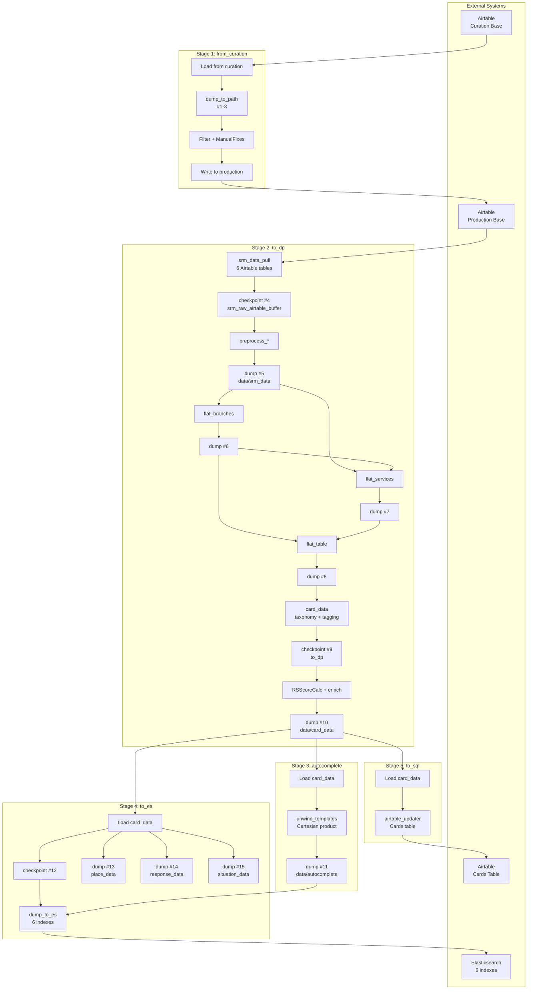

# Plan 05: Checkpoint Map + High-Level Diagram + Final Assembly

<objective>
Complete the analysis document by filling in the "Checkpoint & Cache Map" section with the full 15-entry persistence table, adding the high-level Mermaid pipeline diagram under "Derive Overview", and performing final assembly: verify all sections are populated (no remaining TODO placeholders), ensure TOC anchor links are correct, add a document footer with generation metadata. This plan produces the final deliverable for Phase 1.
</objective>

<tasks>

<task id="01-05-01">
<title>Fill in the Checkpoint & Cache Map table</title>
<read_first>
- ETL/DERIVE-FLOW-ANALYSIS.md
- .planning/phases/01-derive-flow-investigation/01-RESEARCH.md
</read_first>
<action>
Replace the `<!-- TODO: Fill in Plan 05 -->` placeholder under `## Checkpoint & Cache Map` with:

1. An introductory paragraph:
> The derive pipeline uses **15 persistence points**: 3 NDJSON checkpoints and 12 `dump_to_path` caches. Checkpoints provide all-or-nothing cache shortcuts (skip upstream on hit), while `dump_to_path` always writes and serves as inter-sub-flow communication. In the current codebase, all checkpoints are explicitly deleted before use via `shutil.rmtree()`, so they never cache-hit during normal operation — they serve only as crash-recovery restart points.

2. The complete table with exactly these 15 entries:

| # | Path | Module | Type | What It Caches | Invalidation |
|---|------|--------|------|---------------|--------------|
| 1 | `.checkpoints/from-curation-Organizations/` | `from_curation.py` | `dump_to_path` | Raw Organization records from curation Airtable | `shutil.rmtree()` before each table copy |
| 2 | `.checkpoints/from-curation-Branches/` | `from_curation.py` | `dump_to_path` | Raw Branch records from curation Airtable | `shutil.rmtree()` before each table copy |
| 3 | `.checkpoints/from-curation-Services/` | `from_curation.py` | `dump_to_path` | Raw Service records from curation Airtable | `shutil.rmtree()` before each table copy |
| 4 | `.checkpoints/srm_raw_airtable_buffer/` | `to_dp.py` (`srm_data_pull`) | `checkpoint` (NDJSON) | All 6 raw Airtable tables (Responses, Situations, Organizations, Locations, Branches, Services) | `shutil.rmtree()` in `to_dp.operator()` |
| 5 | `data/srm_data/` | `to_dp.py` (`srm_data_pull`) | `dump_to_path` | Preprocessed 6 Airtable tables | `shutil.rmtree()` in `to_dp.operator()` |
| 6 | `data/flat_branches/` | `to_dp.py` (`flat_branches`) | `dump_to_path` | Denormalized branch records (org + location joined) | `shutil.rmtree()` in `to_dp.operator()` |
| 7 | `data/flat_services/` | `to_dp.py` (`flat_services`) | `dump_to_path` | Denormalized service records with branch keys | `shutil.rmtree()` in `to_dp.operator()` |
| 8 | `data/flat_table/` | `to_dp.py` (`flat_table`) | `dump_to_path` | Fully joined service+branch table | `shutil.rmtree()` in `to_dp.operator()` |
| 9 | `.checkpoints/to_dp/` | `to_dp.py` (`card_data`) | `checkpoint` (NDJSON) | Card data after taxonomy mapping + auto-tagging, before RS score | `shutil.rmtree()` in `to_dp.operator()` |
| 10 | `data/card_data/` | `to_dp.py` (`card_data`) | `dump_to_path` | Final card data with all enrichments | `shutil.rmtree()` in `to_dp.operator()` |
| 11 | `data/autocomplete/` | `autocomplete.py` | `dump_to_path` | Generated autocomplete suggestions | Overwritten each run (no explicit delete) |
| 12 | `.checkpoints/to_es/data_api_es_flow/` | `to_es.py` | `checkpoint` (NDJSON) | Cards after ES scoring, before ES load | `shutil.rmtree()` in `to_es.operator()` |
| 13 | `data/place_data/` | `to_es.py` | `dump_to_path` | Location bounds for places | `shutil.rmtree()` in `to_es.operator()` |
| 14 | `data/response_data/` | `to_es.py` | `dump_to_path` | Response taxonomy with card counts | `shutil.rmtree()` in `to_es.operator()` |
| 15 | `data/situation_data/` | `to_es.py` | `dump_to_path` | Situation taxonomy with card counts | `shutil.rmtree()` in `to_es.operator()` |

3. After the table, add a summary:

**Pattern summary:**
- **3 NDJSON checkpoints** (#4, #9, #12): All-or-nothing cache. Currently always pre-deleted, so they only provide restart capability if the pipeline crashes mid-run and is restarted without cleanup.
- **12 `dump_to_path` caches** (#1-3, #5-8, #10-11, #13-15): Always written. The primary mechanism for inter-sub-flow data passing. Sub-flow N writes → sub-flow N+1 reads via `DF.load`.
- **Invalidation**: All but #11 use explicit `shutil.rmtree()`. #11 (`data/autocomplete/`) is implicitly overwritten.

4. Add a data lineage note:
> **Data lineage through caches:** Airtable → #1-3 (raw copy) → #4 (raw buffer) → #5 (preprocessed) → #6 (flat branches) + #7 (flat services) → #8 (flat table) → #9 (taxonomy mapped) → #10 (enriched cards) → #11 (autocomplete) + #12 (ES-scored cards) → #13-15 (ES aggregates) → Elasticsearch indexes + Airtable Cards table.
</action>
<acceptance_criteria>
- Section `## Checkpoint & Cache Map` contains a markdown table with exactly 15 numbered rows
- Table has columns: #, Path, Module, Type, What It Caches, Invalidation
- Table contains all 3 checkpoint paths: `srm_raw_airtable_buffer`, `to_dp`, `to_es/data_api_es_flow`
- Section contains "15 persistence points" and "3 NDJSON checkpoints and 12 dump_to_path"
- Section contains the data lineage note linking cache numbers in order
- The placeholder `<!-- TODO: Fill in Plan 05 -->` no longer appears under this heading
</acceptance_criteria>
</task>

<task id="01-05-02">
<title>Add high-level pipeline Mermaid diagram</title>
<read_first>
- ETL/DERIVE-FLOW-ANALYSIS.md
- .planning/phases/01-derive-flow-investigation/01-RESEARCH.md
</read_first>
<action>
Replace the `<!-- TODO: Fill in Plan 05 -->` placeholder under `### High-Level Pipeline Diagram` with a comprehensive Mermaid diagram showing the complete derive pipeline from input to output, including all 5 stages, key sub-flows, cache/checkpoint locations, and external systems:



Add a paragraph after the diagram explaining:
- Data flows left-to-right through the 5 stages
- Numbered labels (#1-15) correspond to the checkpoint/cache map entries
- Arrows between stages represent disk-based data passing via `dump_to_path` → `DF.load`
- The RSScoreCalc side-channel reads from checkpoint #9 (not shown as a separate arrow to keep the diagram readable)
</action>
<acceptance_criteria>
- `### High-Level Pipeline Diagram` contains a Mermaid diagram with `graph TD`
- Diagram contains subgraph blocks for at least 4 of the 5 stages
- Diagram references cache numbers (#1 through #15 or a subset)
- Diagram includes external systems: Airtable and Elasticsearch
- An explanatory paragraph follows the diagram
- The placeholder `<!-- TODO: Fill in Plan 05 -->` no longer appears under this heading
</acceptance_criteria>
</task>

<task id="01-05-03">
<title>Final assembly — verify completeness, fix TOC, add footer</title>
<read_first>
- ETL/DERIVE-FLOW-ANALYSIS.md
</read_first>
<action>
Perform the following final assembly steps on `ETL/DERIVE-FLOW-ANALYSIS.md`:

1. **Scan for remaining TODO placeholders**: Search for any `<!-- TODO:` comments still in the file. If any exist, they indicate a section that was not filled by Plans 01-04. Remove the placeholder and add a brief note if the section was intentionally left minimal.

2. **Verify TOC anchor links**: Ensure every `## ` and `### ` heading in the document has a corresponding entry in the Table of Contents. If Plans 03 or 04 added sub-headings not in the original scaffold, add them to the TOC.

3. **Add document footer** at the very end of the file:

```markdown
---

*Generated: [current date]*
*Source files analyzed: 12 derive modules + dataflows core package*
*Total persistence points documented: 15 (3 checkpoints + 12 dump_to_path)*

> **Functional test:** After reading this document, you should be able to answer: "If I add a new field to the Services table in Airtable, which files and sub-flows would need modification?" (Answer: `from_curation.py` copies it, `helpers.py` `preprocess_services()` must extract it, `to_dp.py` sub-flows must propagate it through joins, and if it needs ES indexing, `to_es.py` and `es_schemas.py` must add the field mapping.)
```

4. **Verify section ordering** matches the TOC ordering. Sections should appear in the document in the same order they appear in the TOC.

5. **Ensure no empty sections**: Every `## ` or `### ` heading must have at least one line of content below it (not counting blank lines or HTML comments).
</action>
<acceptance_criteria>
- `grep -c "<!-- TODO:" ETL/DERIVE-FLOW-ANALYSIS.md` returns 0 (no remaining TODO placeholders)
- File ends with the functional test block containing "If I add a new field to the Services table"
- File contains "Generated:" in the footer
- File contains "15" and "3 checkpoints" and "12 dump_to_path" in the footer
- Every entry in the Table of Contents has a matching `## ` or `### ` heading in the document
- No heading is immediately followed by another heading with no content between them (except where heading contains inline content on the same line)
</acceptance_criteria>
</task>

</tasks>

<verification>
- `grep -c "<!-- TODO:" ETL/DERIVE-FLOW-ANALYSIS.md` returns 0 (zero remaining TODOs)
- `grep -c "^## \|^### " ETL/DERIVE-FLOW-ANALYSIS.md` returns at least 20 (all sections present)
- `grep "15 persistence points\|3 checkpoints.*12 dump_to_path\|3 NDJSON checkpoints" ETL/DERIVE-FLOW-ANALYSIS.md` returns at least 2 matches
- `grep "Functional test\|If I add a new field" ETL/DERIVE-FLOW-ANALYSIS.md` returns at least 1 match
- `grep "mermaid" ETL/DERIVE-FLOW-ANALYSIS.md` returns at least 3 matches (high-level diagram, to_dp sub-flows, to_es, RSScoreCalc)
- `wc -l ETL/DERIVE-FLOW-ANALYSIS.md` returns between 600 and 1500 lines (research estimated 800-1200)
- The document reads coherently from top to bottom — no section references content from a later section
</verification>

<must_haves>
- All 15 checkpoint/cache locations are documented in a single reference table (ANLYS-06)
- The high-level Mermaid pipeline diagram shows end-to-end data flow through all 5 stages (ANLYS-07)
- Zero TODO placeholders remain in the document (ANLYS-07 — final deliverable completeness)
- The document footer includes the functional test that validates comprehensiveness
- The Table of Contents accurately reflects all sections in the document
- The document is a single self-contained markdown file suitable for reading in GitHub or VS Code
</must_haves>
