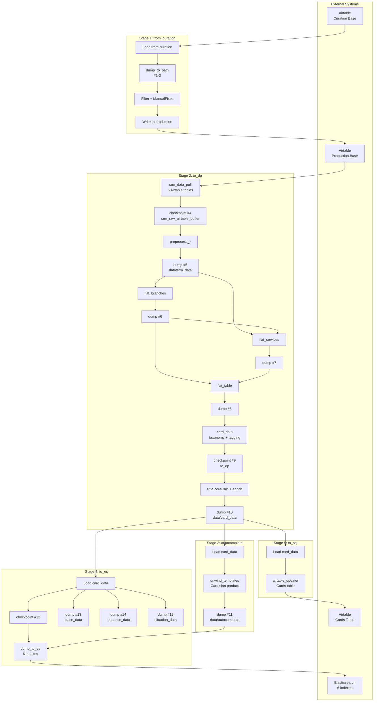
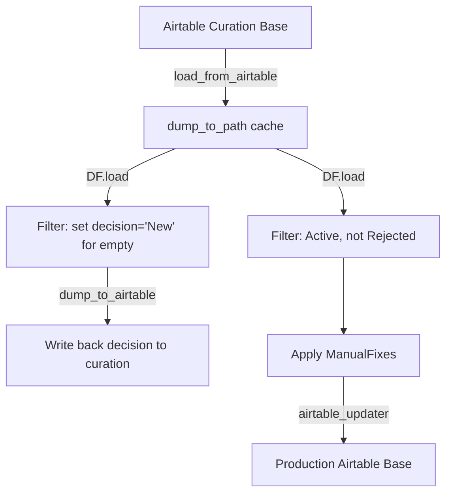
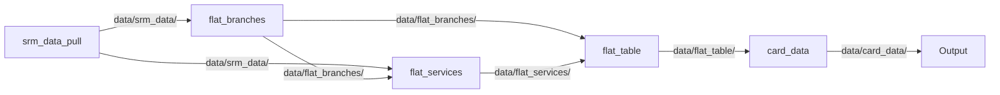
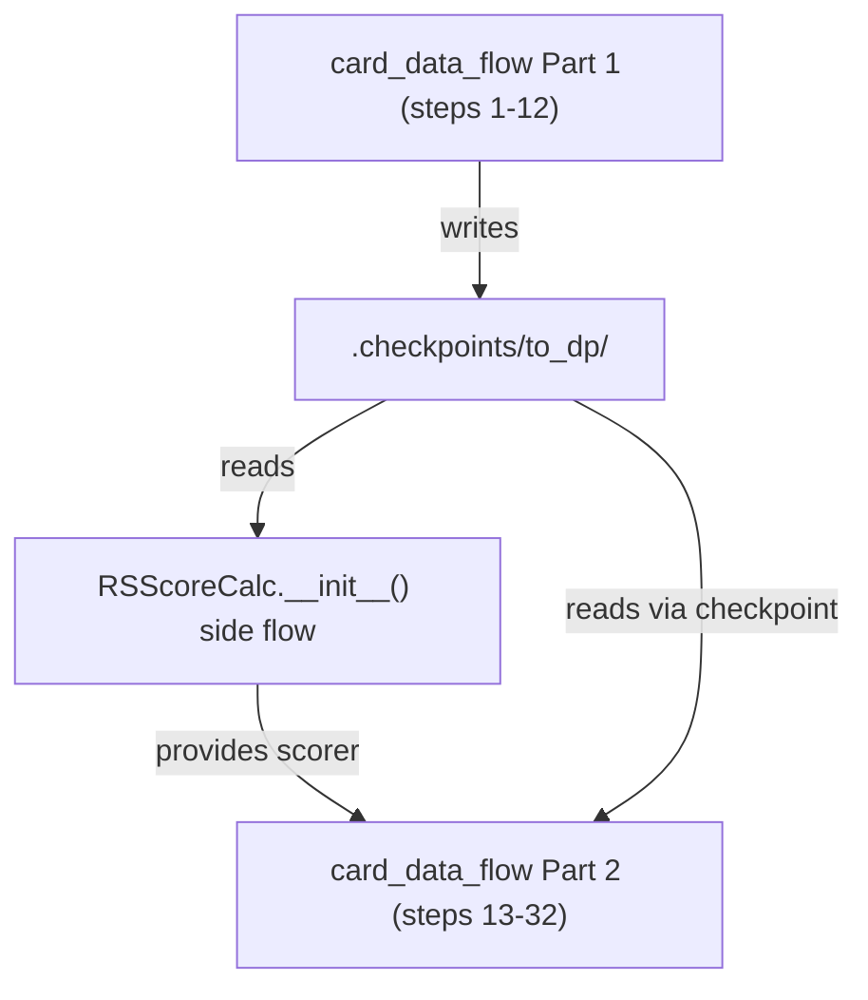
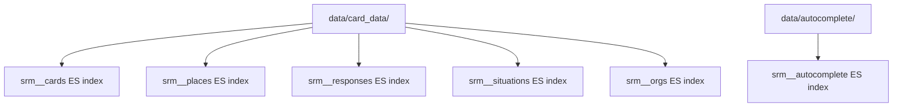

# Derive Operator — Complete Flow Analysis

> **Purpose:** Comprehensive analysis of the `derive` ETL operator in the Kol Sherut pipeline.
> This document explains how the `dataflows` framework works and walks through every stage
> of the derive operator, documenting each processing step, checkpoint, and data transformation.
>
> **Reading guide:** Start with [How dataflows Works](#how-dataflows-works) if you're unfamiliar
> with the framework, then read each stage sequentially. The [Checkpoint & Cache Map](#checkpoint--cache-map)
> at the end provides a quick-reference table of all persistence points.

## Table of Contents

- [How dataflows Works](#how-dataflows-works)
  - [Flow() and Processor Chaining](#flow-and-processor-chaining)
  - [Lazy Evaluation and Pull-Based Execution](#lazy-evaluation-and-pull-based-execution)
  - [Function Auto-Detection](#function-auto-detection)
  - [checkpoint vs dump_to_path](#checkpoint-vs-dump_to_path)
  - [Other Key Processors](#other-key-processors)
- [Derive Overview](#derive-overview)
  - [Entry Point and Orchestration](#entry-point-and-orchestration)
  - [High-Level Pipeline Diagram](#high-level-pipeline-diagram)
- [Stage 1: from_curation — Data Import](#stage-1-from_curation--data-import)
- [Stage 2: to_dp — Core Data Transformation](#stage-2-to_dp--core-data-transformation)
  - [Sub-flow 1: srm_data_pull](#sub-flow-1-srm_data_pull)
  - [Sub-flow 2: flat_branches](#sub-flow-2-flat_branches)
  - [Sub-flow 3: flat_services](#sub-flow-3-flat_services)
  - [Sub-flow 4: flat_table](#sub-flow-4-flat_table)
  - [Sub-flow 5: card_data](#sub-flow-5-card_data)
  - [RSScoreCalc — Side-Channel Flow](#rsscorecalc--side-channel-flow)
- [Stage 3: autocomplete — Autocomplete Generation](#stage-3-autocomplete--autocomplete-generation)
- [Stage 4: to_es — Elasticsearch Loading](#stage-4-to_es--elasticsearch-loading)
  - [Sub-flows in to_es.py](#sub-flows-in-to_espy)
  - [Key pattern: dump_to_es_and_delete](#key-pattern-dump_to_es_and_delete)
- [Stage 5: to_sql — Airtable Card Upload](#stage-5-to_sql--airtable-card-upload)
- [Helper Modules](#helper-modules)
  - [helpers.py — Shared Preprocessing Flows](#helperspy--shared-preprocessing-flows)
  - [autotagging.py — Auto-tagging Rules](#autotaggingpy--auto-tagging-rules)
  - [es_schemas.py — ES Field Schema Constants](#es_schemaspy--es-field-schema-constants)
  - [es_utils.py — ES Connection and Loading](#es_utilspy--es-connection-and-loading)
  - [manual_fixes.py — Manual Fix Application](#manual_fixespy--manual-fix-application)
- [Checkpoint & Cache Map](#checkpoint--cache-map)
- [External Dependencies Reference](#external-dependencies-reference)

---

## How dataflows Works

`dataflows` (v0.5.5) is a Python data processing framework built on the Frictionless Data specification. It provides three core abstractions: **Flow** (pipeline builder), **DataStreamProcessor** (individual processing step), and **DataStream** (descriptor + resource iterators). The derive operator builds complex ETL pipelines using this framework.

### Flow() and Processor Chaining

`Flow(*args)` stores its steps as a tuple in `self.chain`. Calling `.process()` triggers `_chain()`, which wraps each step around the previous `DataStream` in sequence. Each `DataStreamProcessor` receives an upstream DataStream and produces a new one. Nested `Flow` objects are flattened during chaining.

Here is the actual source pattern from `flow.py`:

```python
class Flow:
    def __init__(self, *args):
        self.chain = args           # Store all steps as a tuple

    def process(self):
        return self._chain().process()   # Build chain, then drain it

    def _chain(self, ds=None):
        for position, link in enumerate(self._preprocess_chain(), start=1):
            if isinstance(link, Flow):
                ds = link._chain(ds)               # Nested flows get flattened
            elif isinstance(link, DataStreamProcessor):
                ds = link(ds, position=position)    # Processor wraps upstream
            elif isfunction(link):
                # Auto-detect function signature (see next section)
                ds = auto_wrapped(link)(ds, position=position)
            elif isinstance(link, Iterable):
                ds = iterable_loader(link)(ds, position=position)
        return ds
```


This is a **decorator/wrapper pattern**, not a push-based event system. Each step wraps the previous stream — `.process()` iterates the outermost, triggering a cascade inward through all processors.

### Lazy Evaluation and Pull-Based Execution

The `LazyIterator` class is the key to lazy evaluation. It stores a *function that creates an iterator*, not the iterator itself. The function is only called when someone starts iterating:

```python
class LazyIterator:
    def __init__(self, get_iterator):
        self.get_iterator = get_iterator

    def __iter__(self):
        return self.get_iterator()
```

The pull model works as follows: the terminal consumer (`.process()`, `dump_to_path`, `checkpoint`) starts iterating → pulls data from the outer processor → which pulls from its upstream → all the way to the innermost source. **No work is done until a terminal consumer reads rows.**

"Draining" means `.process()` iterates through all rows silently, triggering the full chain. This is why derive can define large pipelines cheaply — definition is O(1), execution is deferred.

Execution sequence:

1. `.process()` calls outermost processor's `_process()`
2. `_process()` calls `self.source._process()` → gets upstream DataStream
3. Recursion continues to innermost (or `None` → empty DataStream)
4. Each processor wraps resource iterators with its logic via `LazyIterator`
5. Outermost starts iterating → pulls rows through the entire chain
6. Data flows row-by-row through all processors in a single pass

### Function Auto-Detection

When a bare Python function is passed to `Flow()`, dataflows inspects its first parameter **name** (not type annotation) to determine behavior:

| Parameter Name | Behavior | Example |
|---------------|----------|---------|
| `row` | Called once per row, should return modified row or `None` to filter | `def add_field(row): row['x'] = 1` |
| `rows` | Receives a generator of all rows in a resource, must yield rows | `def dedup(rows): seen = set(); ...` |
| `package` | Receives the `PackageWrapper`, can modify schema/metadata | `def add_resource(package): ...` |

This is why derive code freely mixes `DF.*` processor calls with plain functions — they are all valid Flow steps. The auto-detection is based on the first parameter's **name**, not its type annotation. Any other parameter name triggers an assertion error.

### checkpoint vs dump_to_path

**checkpoint (NDJSON serialization):**

`checkpoint` is a `Flow` subclass that intercepts chain-building via `_preprocess_chain()`:

1. **Cache HIT**: replaces the entire upstream chain with `unstream(filename)` — reads an NDJSON file, skips all upstream processing
2. **Cache MISS**: appends `stream(filename)` after the upstream chain — data passes through AND gets serialized to `.checkpoints/<name>/stream.ndjson`

**Critical "absorb" behavior** — `handle_flow_checkpoint()`:

```python
def handle_flow_checkpoint(self, parent_chain):
    self.chain = itertools.chain(self.chain, parent_chain)
    return [self]
```

When a checkpoint is placed inside a `Flow()`, it absorbs ALL preceding steps into its own chain. This means the checkpoint captures everything before it as upstream, not just the immediately preceding step.

Cache invalidation is **manual only** — the derive code uses `shutil.rmtree()` to delete checkpoint directories before running. In the current codebase, checkpoints are always deleted before use, so they effectively never cache-hit during normal operation. They serve as debugging/restart aids only.

**dump_to_path (disk persistence):**

1. Writes all resources to disk as CSV files + `datapackage.json` descriptor
2. Always writes (no cache-hit shortcut)
3. Output is a standard Frictionless Data Package
4. Can be loaded back with `DF.load('path/datapackage.json')`
5. In derive, serves as **inter-sub-flow communication**: sub-flow N dumps → sub-flow N+1 loads

**Comparison:**

| Aspect | `checkpoint` | `dump_to_path` |
|--------|-------------|----------------|
| Format | NDJSON (stream.ndjson) | CSV + datapackage.json |
| Cache behavior | Skips upstream on hit | Always writes |
| Absorbs upstream? | Yes (`handle_flow_checkpoint`) | No |
| Use in derive | 3 locations, always pre-deleted | 12 locations, inter-stage comms |
| Invalidation | Manual `shutil.rmtree()` | Overwritten each run |

### Other Key Processors

Reference table of all `DF.*` processor types used in the derive pipeline:

| Processor | What It Does |
|-----------|-------------|
| `DF.load(path)` | Loads a previously-dumped data package from disk into the flow as new resources |
| `DF.dump_to_path(path)` | Writes all resources to disk as CSV files + datapackage.json |
| `DF.checkpoint(name)` | NDJSON cache — skips upstream on cache hit, writes through on miss |
| `DF.join(source, source_key, target, target_key, fields)` | SQL-like join: consumes source resource into memory, looks up matches for target rows |
| `DF.join_with_self(resource, key, fields)` | Self-join: groups rows by key within a single resource, applying aggregations |
| `DF.set_type(field, type, transform)` | Modifies field schema type and optionally applies a per-value transform function |
| `DF.filter_rows(condition, resources)` | Passes only rows where the predicate function returns True |
| `DF.select_fields(fields)` | Keeps only the listed fields, removes all others from data and schema |
| `DF.delete_fields(fields)` | Removes listed fields from data and schema |
| `DF.update_resource(name, **props)` | Modifies resource metadata (name, path, title) |
| `DF.update_package(**props)` | Modifies package metadata |
| `DF.validate()` | Validates all rows against current schema, raises on type mismatch |
| `DF.sort_rows(key)` | Sorts resource rows by a key expression |
| `DF.add_field(name, type, default)` | Adds a new field to the schema and optionally sets a default/computed value |
| `DF.finalizer(callback)` | Registers a callback that runs after all resources are fully consumed |

For `DF.join`, the `fields` dict specifies which source fields to pull onto target rows, with optional aggregation: `count`, `sum`, `set`, `array`, `first`, etc.

For `DF.finalizer`, this is used in `es_utils.py` to delete old ES documents after new ones are loaded.

---

## Derive Overview

The derive operator transforms data from an Airtable curation base into Elasticsearch indexes and Airtable card records. It runs 5 sequential stages: `from_curation` → `to_dp` → `autocomplete` → `to_es` → `to_sql`. Each stage is a separate Python module that builds and executes one or more dataflows `Flow()` pipelines. No stage runs in parallel — each must complete before the next begins.

### Entry Point and Orchestration

**`__main__.py`** (3 lines — the CLI entry point):

```python
import operators.derive
operators.derive.deriveData()
```

**`__init__.py`** — the `deriveData()` orchestrator:

```python
def deriveData(*_):
    logger.info('Starting Derive Data Flow')
    from_curation.operator()    # Stage 1: Copy data from curation Airtable base
    to_dp.operator()            # Stage 2: Transform into card data packages
    autocomplete.operator()     # Stage 3: Generate autocomplete suggestions
    to_es.operator()            # Stage 4: Load into Elasticsearch
    to_sql.operator()           # Stage 5: Upload cards to Airtable
    logger.info('Finished Derive Data Flow')

def operator(*_):
    invoke_on(deriveData, 'Upload to DB (Derive)')
```

The `invoke_on` wrapper (from `srm_tools.error_notifier`) is a try/except that sends an email notification on failure. Each `*.operator()` call builds and fully executes one or more `Flow().process()` pipelines before returning.

Note: `sys.setrecursionlimit(5000)` is set in `to_dp.py` because deeply nested Flow chains can exceed Python's default recursion limit of 1000.

### High-Level Pipeline Diagram



Data flows top-to-bottom through the 5 stages. Numbered labels (#1-15) correspond to the [Checkpoint & Cache Map](#checkpoint--cache-map) entries below. Arrows between stages represent disk-based data passing via `dump_to_path` → `DF.load`. The RSScoreCalc side-channel reads from checkpoint #9 (not shown as a separate arrow to keep the diagram readable).

---

## Stage 1: from_curation — Data Import

Copies Organizations, Branches, and Services records from the Airtable curation base to the production Airtable base. Applies manual fixes and filters (active, not rejected/suspended, has services).



**Step-by-step walkthrough** — the same pattern repeats for each of 3 tables (Organizations, Branches, Services):

1. **`shutil.rmtree()`** deletes previous cache for this table (e.g., `from-curation-Organizations/`)
2. **`load_from_airtable(curation_base, table)`** pulls all records from the curation Airtable base
3. **`DF.select_fields()`** keeps only the needed columns (data fields + decision + status + id)
4. **`DF.dump_to_path(CHECKPOINT + table)`** caches all records to disk as a data package
5. **`DF.filter_rows()`** selects rows without a `decision` field
6. **`DF.set_type('decision', transform=...)`** sets decision to "New" for empty values
7. **`dump_to_airtable()`** writes the "New" decision back to the curation base
8. **`DF.load(CHECKPOINT + table)`** reloads from the local cache (not from Airtable again — key optimization)
9. **`stats.filter_with_stat()`** applies filters: `status == 'ACTIVE'`, decision not in `['Rejected', 'Suspended']`, entity has services
10. **`manual_fixes.apply_manual_fixes()`** — the `ManualFixes` class loads correction rules from an Airtable table and applies field-level overrides to matching records
11. **`airtable_updater()`** writes to the production Airtable base using hash-based diff (writes only changed records)

Between table updates, `from_curation` also builds conversion dicts (`updated_orgs`, `updated_branches`) to map old record IDs to production IDs, which are used to fix cross-table references (e.g., branch → organization links).

**Cache locations (3 `dump_to_path` caches):**
- `.checkpoints/from-curation-Organizations/`
- `.checkpoints/from-curation-Branches/`
- `.checkpoints/from-curation-Services/`

**Key DF.* calls in from_curation.py:**

| Call | Context |
|------|---------|
| `load_from_airtable(curation_base, table)` | Pull all records from curation |
| `DF.select_fields(fields)` | Keep only needed columns |
| `DF.dump_to_path(CHECKPOINT + table)` | Cache to disk |
| `DF.filter_rows(lambda r: not r.get('decision'))` | Find records without a decision |
| `DF.set_type('decision', transform=...)` | Set "New" decision |
| `dump_to_airtable(...)` | Write decisions back to curation |
| `DF.load(CHECKPOINT + table + '/datapackage.json')` | Reload from cache |
| `DF.update_resource(-1, name=...)` | Rename resource for updater |
| `stats.filter_with_stat(...)` | Filter + record rejection stats |
| `manual_fixes.apply_manual_fixes()` | Apply manual corrections |
| `DF.delete_fields(['source', 'status'])` | Remove internal fields |
| `fetch_mapper(fields=...)` / `update_mapper()` | Prepare for airtable_updater |

---

## Stage 2: to_dp — Core Data Transformation

The largest and most complex derive module at 946 lines. Transforms raw Airtable data into a denormalized "card data" format suitable for Elasticsearch indexing. Contains 5 sequential sub-flows.

**`operator()` entry point** — cleanup then execute:

```python
def operator():
    shutil.rmtree('.checkpoints/to_dp', ...)           # Delete checkpoint
    shutil.rmtree('.checkpoints/srm_raw_airtable_buffer', ...)  # Delete raw buffer
    for subdir in ('srm_data', 'flat_branches', 'flat_services', 'flat_table', 'card_data'):
        shutil.rmtree(f'{DATA_DUMP_DIR}/{subdir}', ...)  # Clean all intermediate dirs

    branch_mapping = dict()
    srm_data_pull_flow().process()              # Sub-flow 1
    flat_branches_flow(branch_mapping).process() # Sub-flow 2
    flat_services_flow(branch_mapping).process() # Sub-flow 3
    flat_table_flow().process()                  # Sub-flow 4
    card_data_flow().process()                   # Sub-flow 5 (no .process() — runs internally)
```

The 5 sub-flows:

| # | Sub-flow | Purpose |
|---|----------|---------|
| 1 | `srm_data_pull_flow()` | Pull and preprocess all Airtable tables |
| 2 | `flat_branches_flow(branch_mapping)` | Denormalize branches with org+location data |
| 3 | `flat_services_flow(branch_mapping)` | Denormalize services with branch data |
| 4 | `flat_table_flow()` | Join into final flat service-branch pairs |
| 5 | `card_data_flow()` | Enrich with taxonomy, scoring, autocomplete, address parsing |



The `branch_mapping` dict is shared by reference between sub-flows 2 and 3 — flat_branches populates it with old→new branch key mappings after deduplication, and flat_services reads it to redirect merged branch IDs.

### Sub-flow 1: srm_data_pull

Pulls curated data from the production Airtable base and preprocesses all 6 tables:

1. **`load_from_airtable()`** × 6 — loads Responses, Situations, Organizations, Locations, Branches, Services from the production Airtable base
2. **`DF.update_package(name='SRM Data')`** — set package name
3. **`DF.checkpoint('srm_raw_airtable_buffer')`** — caches all 6 raw Airtable tables as NDJSON (absorbs the 6 loads above)
4. **`helpers.preprocess_responses(validate=True)`** — apply response-specific cleaning and field extraction
5. **`helpers.preprocess_situations(validate=True)`** — apply situation-specific cleaning
6. **`helpers.preprocess_services(validate=True)`** — apply service-specific cleaning, normalize fields
7. **`helpers.preprocess_organizations(validate=True)`** — clean org records, normalize via `clean_org_name`
8. **`helpers.preprocess_branches(validate=True)`** — clean branch records, extract location references
9. **`helpers.preprocess_locations(validate=True)`** — clean location records, extract geocoding data
10. **`DF.dump_to_path('data/srm_data')`** — writes all 6 preprocessed tables to disk

Each `helpers.preprocess_*()` returns a list of DF.* steps that are unpacked into the parent Flow.

### Sub-flow 2: flat_branches

Produces a denormalized view of branch records with organization and location data inlined:

1. **`DF.load('data/srm_data/datapackage.json', resources=['branches', 'locations', 'organizations'])`** — load 3 tables from srm_data
2. **`DF.update_resource(['branches'], name='flat_branches')`** — rename for processing
3. **`DF.rename_fields({'address': 'orig_address'})`** — preserve original address
4. **`stats.filter_with_stat(...)`** — filter branches without locations
5. **`DF.add_field('location_key', ...)`** — extract location reference
6. **`DF.join('locations', ['key'], 'flat_branches', ['location_key'], ...)`** — join location data (geometry, address, city) onto branches
7. **`DF.set_type('address', transform=select_address)`** — pick best address from available fields
8. **`DF.add_field('organization_key', ...)`** — extract org reference
9. **`stats.filter_with_stat(...)`** — filter branches without valid organizations
10. **`DF.join('organizations', ['key'], 'flat_branches', ['organization_key'], ...)`** — join all org fields onto branches (inner join)
11. **`DF.rename_fields({...})`** — prefix all fields with `branch_` or `organization_`
12. **`DF.select_fields([...])`** — keep only needed columns
13. **`DF.validate()`** — validate against schema
14. **`merge_duplicate_branches(branch_mapping)`** — **buffers all rows in memory**, deduplicates branches by (org_id + geometry + name) using hash keys. Populates `branch_mapping` dict with old→new key mappings. Uses the consuming-generator pattern (breaks streaming, but necessary for dedup).
15. **`DF.dump_to_path('data/flat_branches')`** — write denormalized branches to disk

> **Memory note:** `merge_duplicate_branches` must buffer all rows before yielding, breaking the streaming model. This is by design — deduplication requires seeing all rows before deciding which to keep.

### Sub-flow 3: flat_services

Produces a denormalized view of service records with branch data:

1. **`DF.load('data/flat_branches/datapackage.json', resources=['flat_branches'])`** — load denormalized branches
2. **`DF.load('data/srm_data/datapackage.json', resources=['services'])`** — load services
3. **`collect_branches`** — custom function that builds a branch_map and tracks national vs non-national branches
4. **`unwind('organizations', 'organization_key')`** — one-to-many expansion: a service with multiple orgs becomes multiple rows
5. **`DF.join('flat_branches', ['organization_key'], 'flat_services', ['organization_key'], ...)`** — join organization branches onto services (aggregate: `set`)
6. **`DF.set_type('branches', transform=...)`** — apply `branch_mapping` to redirect merged branch IDs
7. **`DF.set_type('organization_branches', transform=filter_soproc_branches)`** — filter soproc service branches (keep national-only if >5 branches)
8. **`DF.add_field('merge_branches', ...)`** — merge direct branches + org branches into one array
9. **`unwind('merge_branches', 'branch_key')`** — final expansion to one row per (service, branch) pair
10. **`DF.rename_fields({...})`** — prefix service fields with `service_`
11. **`DF.select_fields([...])`** — keep only needed columns
12. **`DF.validate()`** — validate against schema
13. **`DF.dump_to_path('data/flat_services')`** — write to disk

### Sub-flow 4: flat_table

The simplest sub-flow — its purpose is to produce the final joined table with one fully denormalized row per (service, branch) pair:

1. **`DF.load('data/flat_branches/datapackage.json')`** — load flat branches
2. **`DF.load('data/flat_services/datapackage.json')`** — load flat services
3. **`DF.join('flat_branches', ['branch_key'], 'flat_table', ['branch_key'], ...)`** — join all branch/org fields onto services (inner join)
4. **`DF.add_field('branch_short_name', ...)`** — compute branch short name
5. **`DF.filter_rows(unique_service_branch)`** — deduplicate by (service_id, branch_id)
6. **`DF.set_primary_key(['service_id', 'branch_id'])`** — set composite primary key
7. **`DF.select_fields([...])`** — keep all needed columns (~35 fields)
8. **`DF.validate()`** — validate
9. **`DF.dump_to_path('data/flat_table')`** — write final joined table

### Sub-flow 5: card_data

The most complex sub-flow. Enriches the flat table with taxonomy mapping, auto-tagging, relevance scoring, parent taxonomy IDs, autocomplete values, address parsing, and org name parsing.

**card_data_flow() has a two-part execution:**

**Part 1 (runs as Flow().process()):**
```
card_data_flow() steps — Part 1:
─────────────────────────────────
 1. DF.load('data/flat_table/datapackage.json')
 2. Update resource name to 'card_data'
 3. Generate card_id (hash of branch_id + service_id)
 4. merge_duplicate_services — sort by implements, dedup orgs that implement others
 5. Add situation_ids — merge service/branch/org situations
 6. Normalize taxonomy IDs — fix comma-concat, canonicalize roots
 7. Map taxonomy IDs — resolve Airtable keys to canonical taxonomy IDs
 8. Fix situations — remove redundant gender/language tags, add Arabic for Arab/Bedouin
 9. Add response_ids — merge service responses
10. Map response IDs — resolve Airtable keys to canonical taxonomy IDs
11. apply_auto_tagging() — keyword-based tagging rules from Airtable
12. Filter: no responses → reject via stats
    ── checkpoint('to_dp') SPLITS HERE ──
```

**Part 2 (runs as a returned Flow):**
```
card_data_flow() steps — Part 2:
─────────────────────────────────
13. DF.checkpoint(CHECKPOINT) — read from the checkpoint written in Part 1
14. Add situations as structured objects (with name, synonyms from lookup)
15. Add responses as structured objects (with name, synonyms from lookup)
16. RSScoreCalc.process() — compute relevance scores (side-channel flow)
17. Add parent taxonomy IDs for situations and responses
18. Delete raw taxonomy fields, add parent situation/response objects
19. Set ES-specific field types (keyword, etc.)
20. Add response_categories and response_category
21. Filter: no response category → reject
22. Reorder responses by category
23. Filter: invalid location (unless national service)
24. Add possible_autocomplete values
25. Add location fields: point_id, national_service_details, coords, collapse_key
26. Parse address_parts for ES faceting
27. Clean and parse org_name_parts
28. Add organization_resolved_name
29. Set ES keyword types on ID fields
30. count_meser_records() — stats logging
31. DF.validate()
32. DF.dump_to_path('data/card_data')
```

The `checkpoint('to_dp')` in Part 1 absorbs steps 1-12 and serializes to NDJSON. Part 2 starts by reading from this checkpoint. Note that during normal operation the checkpoint is always pre-deleted, so both parts always execute — the checkpoint serves as the data bridge between the two Flow executions.

### RSScoreCalc — Side-Channel Flow

This is a **flow-within-a-flow** pattern — unusual and important to highlight.

`RSScoreCalc.__init__()` runs a *separate* `DF.Flow` that reads from the `to_dp` checkpoint:

```python
class RSScoreCalc:
    def __init__(self):
        per_response = DF.Flow(
            DF.checkpoint(CHECKPOINT),                    # Read from to_dp checkpoint
            DF.select_fields(['situation_ids', 'response_ids']),
            unwind('situation_ids', 'situation_id'),
            unwind('response_ids', 'response_id'),
            DF.join_with_self('card_data', ['situation_id', 'response_id'],
                dict(..., frequency=dict(aggregate='count'))),  # Count per (situation, response)
            ...                                           # Group by response, collect situation counts
        ).results()[0][0]
```

This side flow computes **per-response and per-situation frequencies** — how many cards exist for each taxonomy combination. These frequencies are then used to assign relevance scores (RS scores) to each card via `self.scores[(situation_id, response_id)] = log(total / freq)`.

The side flow MUST run after the `to_dp` checkpoint has been written — this is why the checkpoint exists in the middle of `card_data_flow()`. The timeline:



The scorer assigns higher scores to cards with more unique taxonomy combinations (rarer = more relevant). Cards with low scores get their outermost situations removed until they fit within `MAX_SCORE = 30`.

---

## Stage 3: autocomplete — Autocomplete Generation

Generates search autocomplete suggestions by combining response names, situation names, organization names, and cities using 10 template patterns. Produces a deduplicated, scored list.

**Templates** (Hebrew-language patterns):

```python
TEMPLATES = [
    '{response}',
    '{situation}',
    '{response} עבור {situation}',
    '{org_name}',
    '{response} של {org_name}',
    '{org_id}',
    '{response} ב{city_name}',
    'שירותים עבור {situation} ב{city_name}',
    '{response} עבור {situation} ב{city_name}',
    '{response} של {org_name} ב{city_name}',
]
```

**Flow walkthrough** of `autocomplete_flow()`:

1. **`DF.load('data/card_data/datapackage.json')`** — load enriched card data from Stage 2
2. **`DF.add_field(...)` × 14** — add all autocomplete output fields (query, response, situation, org, city, etc.)
3. **`unwind_templates()`** — **Cartesian product generator**: each card row expands into many autocomplete entries — combinations of 10 templates × responses × situations × orgs × cities. This is the most memory/compute-intensive operation per row. Filters out entries for ignored situations, invalid org IDs, and non-Hebrew city names. Marks entries as `low` (less relevant) when the taxonomy ID is from a parent rather than a direct match.
4. **`DF.sort_rows(['importance'])`** — sort by template importance (earlier templates = higher importance)
5. **`DF.join_with_self('autocomplete', ['query'], ...)`** — deduplicate: group by query string, count occurrences as `score`, keep first-seen values for all other fields
6. **`get_bounds()`** — fuzzy-match city names against a location dataset to get geo bounding boxes
7. **`DF.set_type('score', transform=lambda v: (log(v) + 1)**2)`** — logarithmic scoring by frequency
8. **`DF.set_type('score', transform=...)`** — override score to 0.5 for `low` entries
9. **`DF.set_type(...)` × several** — apply ES type hints: `es:autocomplete`, `es:hebrew`, `es:keyword`
10. **`DF.add_field('id', ...)`** — generate ID from alphanumeric chars in query
11. **`DF.dump_to_path('data/autocomplete')`** — write to disk

**Cache location:** `data/autocomplete/` — implicitly overwritten each run (no explicit `shutil.rmtree()`).

The autocomplete output is later loaded by `to_es.py` (Stage 4) for indexing into the Elasticsearch autocomplete index.

---

## Stage 4: to_es — Elasticsearch Loading

Loads transformed data into 6 Elasticsearch indexes: **cards, places, responses, situations, organizations, autocomplete**. Applies scoring, field typing, and manages index versioning (load new data, then delete old revision documents).

**`operator()` entry** — cleanup then execute:

```python
def operator():
    shutil.rmtree('.checkpoints/to_es', ...)
    for subdir in ('place_data', 'response_data', 'situation_data'):
        shutil.rmtree(f'{DATA_DUMP_DIR}/{subdir}', ...)
    data_api_es_flow()              # Cards → ES
    load_locations_to_es_flow()     # Places → ES
    load_responses_to_es_flow()     # Responses → ES
    load_situations_to_es_flow()    # Situations → ES
    load_organizations_to_es_flow() # Organizations → ES
    load_autocomplete_to_es_flow()  # Autocomplete → ES
```



### Sub-flows in to_es.py:

**a. `data_api_es_flow()` — primary card loading:**
1. `DF.load('data/card_data/datapackage.json')` — load enriched card data
2. `DF.add_field('score', 'number', card_score)` — compute card relevance score (factors: meser prefix, description, national service, branch count, org kind, boost)
3. `DF.add_field('airtable_last_modified', 'datetime', ...)` — compute latest modification date
4. `DF.set_type(...)` × 18 — apply `es:*` type hints from `es_schemas.py` (taxonomy items, URLs, keyword strings, non-indexed strings)
5. `dump_to_es_and_delete(indexes=dict(srm__cards=[...]))` — bulk index into ES, then delete old-revision documents
6. `DF.checkpoint('to_es/data_api_es_flow')` — cache cards after ES loading

**b. `load_locations_to_es_flow()` — places with bounds:**
1. Download location bounds from external URL (zip file)
2. Add predefined regions (Gush Dan, Jerusalem area, North, Beer Sheva area)
3. `DF.concatenate(...)` — merge all place records
4. `DF.add_field('score', ...)` — compute score based on area size × place type weight
5. `DF.dump_to_path('data/place_data')` — cache to disk
6. `dump_to_es_and_delete(indexes=dict(srm__places=[...]))` — load into ES

**c. `load_responses_to_es_flow()` — response taxonomy with card counts:**
1. Load card_data, expand response_ids with parents, count cards per response
2. Load responses from Airtable, join counts onto taxonomy
3. Filter: active and has cards
4. `DF.dump_to_path('data/response_data')` — cache to disk
5. `dump_to_es_and_delete(indexes=dict(srm__responses=[...]))` — load into ES

**d. `load_situations_to_es_flow()` — situation taxonomy with card counts:**
Same pattern as responses — counts cards per situation, loads into ES.

**e. `load_organizations_to_es_flow()` — organization records:**
1. Load srm_data/organizations + card_data
2. `DF.join_with_self('card_data', ['organization_id'], ...)` — count cards per org
3. Join org details, sort by count
4. `dump_to_es_and_delete(indexes=dict(srm__orgs=[...]))` — load into ES

**f. `load_autocomplete_to_es_flow()` — autocomplete suggestions:**
1. `DF.load('data/autocomplete/datapackage.json')` — load from Stage 3
2. `dump_to_es_and_delete(indexes=dict(srm__autocomplete=[...]))` — load into ES

### Key pattern: `dump_to_es_and_delete`

The revision-based atomic swap pattern from `es_utils.py`:

1. Generate a unique `revision` UUID for this run
2. `DF.add_field('revision', ...)` — tag every record with the revision ID
3. `dump_to_es(...)` — bulk index all records into ES
4. `DF.finalizer(deleter)` — after all resources are consumed, query ES for documents with an older revision and delete them via `delete_by_query`

This provides atomic-swap-like behavior without downtime — new data is visible immediately, old data is cleaned up after a 30-second delay.

**Cache locations in to_es (4 persistence points):**
- `.checkpoints/to_es/data_api_es_flow/` — checkpoint (NDJSON)
- `data/place_data/` — dump_to_path
- `data/response_data/` — dump_to_path
- `data/situation_data/` — dump_to_path

---

## Stage 5: to_sql — Airtable Card Upload

> ⚠️ **Misleading module name**: `to_sql.py` does NOT write to a SQL database. The original SQL functionality is commented out. The active function `cards_to_at_flow()` writes to Airtable. This is legacy naming that hasn't been updated.

Writes a small subset of card data back to the Airtable Cards table for use in the curation interface.

**Active function — `cards_to_at_flow()`:**

1. `DF.load('data/card_data/datapackage.json')` — load card data from Stage 2
2. `DF.add_field('data', 'object', ...)` — select a small subset of fields: `organization_id`, `service_id`, `branch_id`, `situation_ids`, `response_ids`, `service_boost`, `organization_branch_count`, `branch_location_accurate`
3. `DF.add_field('id', 'string', lambda r: r.get('card_id'))` — use card_id as the record ID
4. `DF.select_fields(['id', 'data'])` — keep only id + data object
5. `airtable_updater(CARDS_TABLE, 'card', FIELDS, flow, update_mapper())` — diff against existing Cards table and write only changed records

**Dead code:** `dump_to_sql_flow()` and a commented-out `relational_sql_flow()` exist in the file but are not called. These were previous output targets that have been replaced by the Airtable upload pattern.

**No separate cache:** This stage does not create any `dump_to_path` or `checkpoint` — it reads directly from `data/card_data/` and writes to Airtable.

---

## Helper Modules

### helpers.py — Shared Preprocessing Flows

389 lines of shared preprocessing flows and utility functions used across multiple stages.

**Preprocessing flows** — each returns a list of `DF.*` steps that get unpacked into the calling Flow with `*preprocess_services()` syntax. These are NOT standalone Flows — they are step lists composed into the parent Flow:

| Function | Purpose |
|----------|--------|
| `preprocess_responses(validate)` | Cleans response records, extracts taxonomy fields (id, name, synonyms, breadcrumbs) |
| `preprocess_situations(validate)` | Cleans situation records, extracts taxonomy fields |
| `preprocess_services(validate)` | Cleans service records, normalizes fields, extracts situation/response ID arrays |
| `preprocess_organizations(validate)` | Cleans org records, normalizes org names via `clean_org_name` |
| `preprocess_branches(validate)` | Cleans branch records, extracts location references |
| `preprocess_locations(validate)` | Cleans location records, extracts geocoding data (geometry, resolved_city) |

**Key utility functions:**

- **`address_parts(row)`** — split address into `primary` (street + number) and `secondary` (city) for ES faceting
- **`org_name_parts(row)`** — split organization names into `primary` and `secondary` parts for autocomplete
- **`update_taxonomy_with_parents(ids)`** — given a list of taxonomy IDs, expand each to include all parent IDs up to the root (e.g., `human_situations:health:cancer` → also adds `human_situations:health` and `human_situations`)
- **`validate_address(v)`** — check that an address string is non-empty and contains Hebrew characters
- **`validate_geometry(geom)`** — check that a geometry point is valid (non-null, within Israel's bounding box)
- **`calculate_branch_short_name(row)`** — derive a short display name for branches
- **`calc_point_id(geometry)`** — create a deterministic string ID from geo coordinates
- **`most_common_category(row)`** — find the most frequent response category across a card's responses
- **`get_stats()`** — returns a shared `Stats` instance for recording processing statistics

### autotagging.py — Auto-tagging Rules

~80 lines. Loads keyword-based tagging rules from the Airtable "Auto Tagging" table in the data entry base.

For each rule: if the organization name, organization purpose, or service name **ends with** or **contains** a specified query string, the corresponding situation and/or response taxonomy IDs are appended to the record.

Each rule is a row from Airtable with fields:
- `Query` — the search string to match against
- `In Org Name` / `In Org Purpose` / `In Service Name` — which fields to search
- `situation_ids` — situation taxonomy IDs to add on match
- `response_ids` — response taxonomy IDs to add on match

The matching logic: `value.endswith(query) or (query + ' ') in value` — this ensures partial matches like "סרטן" match "האגודה למלחמה בסרטן" but not "סרטןי".

Called within `card_data_flow()` in `to_dp.py` (step 11, before the `to_dp` checkpoint). Adds matched IDs to an `auto_tagged` field so the RS scorer can discount auto-tagged taxonomy pairs.

### es_schemas.py — ES Field Schema Constants

~55 lines. Defines `es:*` type hint constants used by `dataflows_elasticsearch` to generate Elasticsearch field mappings.

**Key type hint constants:**

| Constant | ES Behavior |
|----------|------------|
| `KEYWORD_ONLY` (`es:keyword: True`) | Exact match field, no analysis |
| `KEYWORD_STRING` (`es:itemType: string, es:keyword: True`) | Array of exact-match strings |
| `ITEM_TYPE_STRING` (`es:itemType: string`) | Array of analyzed text strings |
| `ITEM_TYPE_NUMBER` (`es:itemType: number`) | Array of numeric values |
| `NON_INDEXED_STRING` (`es:itemType: string, es:index: False`) | Stored but not searchable |
| `URL_SCHEMA` | Nested object with `href` + `text` fields, not indexed |
| `TAXONOMY_ITEM_SCHEMA` | Nested object with `id` (keyword) + `name` (title) + `synonyms` (title) |
| `ADDRESS_PARTS_SCHEMA` | Object with `primary` (keyword + text) + `secondary` (text) |
| `LAST_MODIFIED_DATE` | Date field with flexible format |

These constants are applied via `DF.set_type(field, **SCHEMA)` calls in `to_es.py` before loading data into ES. The `SRMMappingGenerator` in `es_utils.py` interprets these hints to add Hebrew analyzer fields where appropriate.

### es_utils.py — ES Connection and Loading

~95 lines. Creates the Elasticsearch client connection and provides the custom mapping generator and bulk loading function.

**`es_instance()`** — creates an `elasticsearch.Elasticsearch` client with retry logic (429, 502, 503, 504 retries), 60s timeout, and optional HTTP auth from settings.

**`SRMMappingGenerator`** — extends the default `dataflows-elasticsearch` `MappingGenerator` to:
- Add Hebrew analyzer configuration for text fields (using ICU tokenizer + ICU folding)
- Auto-detect fields ending in `_name`, `_purpose`, `_description`, `_details`, `_synonyms`, `_heb` and add a `.hebrew` sub-field
- Handle `es:keyword` → `keyword` type, `es:autocomplete` → `search_as_you_type` type
- Force `index: True` for numeric and geopoint fields

**`dump_to_es_and_delete(indexes, ...)`** — the core ES loading function:
1. Generate a unique `revision` UUID
2. `DF.add_field('revision', 'string', unique_id, es:keyword=True)` — tag every record
3. `dump_to_es(**kwargs)` — bulk index using the custom `SRMMappingGenerator`
4. `DF.delete_fields(['revision'])` — remove revision from downstream
5. `DF.finalizer(deleter)` — after all resources consumed, wait 30s, then `delete_by_query` for documents with non-matching revision → atomic swap

Used by `to_es.py` for all 6 ES indexes (cards, places, responses, situations, orgs, autocomplete).

### manual_fixes.py — Manual Fix Application

~170 lines. Loads correction rules from the Airtable ManualFixes table and applies field-level overrides during data import.

**`ManualFixes` class:**

1. **`__init__()`** — loads all manual fix records from the ManualFixes table in the data import Airtable base. Keys them by Airtable record ID.

2. **`apply_manual_fixes()`** — returns a `DF.Flow(func)` step that:
   - For each row, checks its `fixes` field (array of Airtable record IDs referencing ManualFixes)
   - For each fix: reads `field`, `current_value`, `fixed_value` from the fix record
   - If the row's actual value matches `current_value` (or `current_value` is `'*'`): apply the override
   - Special handling for `responses` and `situations` fields: normalizes comma-separated ID lists before comparison
   - Tracks fix status: marks each fix as `'Active'` (applied) or `'Obsolete'` (target value no longer matches)
   - Falls back to reloading fixes without view filter if a referenced fix ID is not found

3. **`finalize()`** — writes fix status (`Active`/`Obsolete`) back to the ManualFixes Airtable table in batches of 50

Used only in Stage 1 (`from_curation.py`) — applied to Organizations, Branches, and Services during the curation copy.

---

## Checkpoint & Cache Map

The derive pipeline uses **15 persistence points**: 3 NDJSON checkpoints and 12 `dump_to_path` caches. Checkpoints provide all-or-nothing cache shortcuts (skip upstream on hit), while `dump_to_path` always writes and serves as inter-sub-flow communication. In the current codebase, all checkpoints are explicitly deleted before use via `shutil.rmtree()`, so they never cache-hit during normal operation — they serve only as crash-recovery restart points.

| # | Path | Module | Type | What It Caches | Invalidation |
|---|------|--------|------|---------------|--------------|
| 1 | `.checkpoints/from-curation-Organizations/` | `from_curation.py` | `dump_to_path` | Raw Organization records from curation Airtable | `shutil.rmtree()` before each table copy |
| 2 | `.checkpoints/from-curation-Branches/` | `from_curation.py` | `dump_to_path` | Raw Branch records from curation Airtable | `shutil.rmtree()` before each table copy |
| 3 | `.checkpoints/from-curation-Services/` | `from_curation.py` | `dump_to_path` | Raw Service records from curation Airtable | `shutil.rmtree()` before each table copy |
| 4 | `.checkpoints/srm_raw_airtable_buffer/` | `to_dp.py` (`srm_data_pull`) | `checkpoint` (NDJSON) | All 6 raw Airtable tables (Responses, Situations, Organizations, Locations, Branches, Services) | `shutil.rmtree()` in `to_dp.operator()` |
| 5 | `data/srm_data/` | `to_dp.py` (`srm_data_pull`) | `dump_to_path` | Preprocessed 6 Airtable tables | `shutil.rmtree()` in `to_dp.operator()` |
| 6 | `data/flat_branches/` | `to_dp.py` (`flat_branches`) | `dump_to_path` | Denormalized branch records (org + location joined) | `shutil.rmtree()` in `to_dp.operator()` |
| 7 | `data/flat_services/` | `to_dp.py` (`flat_services`) | `dump_to_path` | Denormalized service records with branch keys | `shutil.rmtree()` in `to_dp.operator()` |
| 8 | `data/flat_table/` | `to_dp.py` (`flat_table`) | `dump_to_path` | Fully joined service+branch table | `shutil.rmtree()` in `to_dp.operator()` |
| 9 | `.checkpoints/to_dp/` | `to_dp.py` (`card_data`) | `checkpoint` (NDJSON) | Card data after taxonomy mapping + auto-tagging, before RS score | `shutil.rmtree()` in `to_dp.operator()` |
| 10 | `data/card_data/` | `to_dp.py` (`card_data`) | `dump_to_path` | Final card data with all enrichments | `shutil.rmtree()` in `to_dp.operator()` |
| 11 | `data/autocomplete/` | `autocomplete.py` | `dump_to_path` | Generated autocomplete suggestions | Overwritten each run (no explicit delete) |
| 12 | `.checkpoints/to_es/data_api_es_flow/` | `to_es.py` | `checkpoint` (NDJSON) | Cards after ES scoring, before ES load | `shutil.rmtree()` in `to_es.operator()` |
| 13 | `data/place_data/` | `to_es.py` | `dump_to_path` | Location bounds for places | `shutil.rmtree()` in `to_es.operator()` |
| 14 | `data/response_data/` | `to_es.py` | `dump_to_path` | Response taxonomy with card counts | `shutil.rmtree()` in `to_es.operator()` |
| 15 | `data/situation_data/` | `to_es.py` | `dump_to_path` | Situation taxonomy with card counts | `shutil.rmtree()` in `to_es.operator()` |

**Pattern summary:**
- **3 NDJSON checkpoints** (#4, #9, #12): All-or-nothing cache. Currently always pre-deleted, so they only provide restart capability if the pipeline crashes mid-run and is restarted without cleanup.
- **12 `dump_to_path` caches** (#1-3, #5-8, #10-11, #13-15): Always written. The primary mechanism for inter-sub-flow data passing. Sub-flow N writes → sub-flow N+1 reads via `DF.load`.
- **Invalidation**: All but #11 use explicit `shutil.rmtree()`. #11 (`data/autocomplete/`) is implicitly overwritten.

> **Data lineage through caches:** Airtable → #1-3 (raw copy) → #4 (raw buffer) → #5 (preprocessed) → #6 (flat branches) + #7 (flat services) → #8 (flat table) → #9 (taxonomy mapped) → #10 (enriched cards) → #11 (autocomplete) + #12 (ES-scored cards) → #13-15 (ES aggregates) → Elasticsearch indexes + Airtable Cards table.

---

## External Dependencies Reference

| Dependency | What It Provides |
|------------|------------------|
| `conf.settings` | All configuration: Airtable base IDs, table names, API keys, ES host/port, data dump directory, external API URLs. Loaded from environment variables via `dotenv`. |
| `srm_tools.logger` | Python logging wrapper used throughout derive |
| `srm_tools.processors` | `fetch_mapper` / `update_mapper` — helper processors for Airtable bulk update patterns |
| `srm_tools.stats.Stats` | Load/update stats records in Airtable; `filter_with_stat` filters rows and records rejected count |
| `srm_tools.stats.Report` | Collects rejected records for specific filters into a report |
| `srm_tools.update_table.airtable_updater` | Bulk update flow for Airtable: loads existing records, diffs via hash, writes only changed records |
| `srm_tools.hash.hasher` | SHA-1 based short hash for generating deterministic card IDs |
| `srm_tools.unwind.unwind` | Array unwinding processor (one-to-many row expansion), similar to MongoDB's `$unwind` |
| `srm_tools.data_cleaning.clean_org_name` | Organization name normalization |
| `srm_tools.error_notifier.invoke_on` | Try/except wrapper that sends email notification on failure |
| `dataflows_airtable` | `load_from_airtable` (Airtable source), `dump_to_airtable` (Airtable sink), `AIRTABLE_ID_FIELD` constant |
| `dataflows_elasticsearch` | `dump_to_es` — Elasticsearch bulk index processor |
| `dataflows_ckan` | `dump_to_ckan` — CKAN open data portal sink (referenced but not actively used in derive) |
| `thefuzz` | Fuzzy string matching — used for branch deduplication (fuzz.ratio) and city name matching in autocomplete |

Per decision D-06, these are surface-level references. To trace into any external dependency's source code, refer to the respective package documentation or source repository.

---

*Generated: 2026-03-22*
*Source files analyzed: 12 derive modules + dataflows core package*
*Total persistence points documented: 15 (3 checkpoints + 12 dump_to_path)*

> **Functional test:** After reading this document, you should be able to answer: "If I add a new field to the Services table in Airtable, which files and sub-flows would need modification?" (Answer: `from_curation.py` copies it, `helpers.py` `preprocess_services()` must extract it, `to_dp.py` sub-flows must propagate it through joins, and if it needs ES indexing, `to_es.py` and `es_schemas.py` must add the field mapping.)
