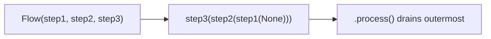

# Derive Operator — Complete Flow Analysis

> **Purpose:** Comprehensive analysis of the `derive` ETL operator in the Kol Sherut pipeline.
> This document explains how the `dataflows` framework works and walks through every stage
> of the derive operator, documenting each processing step, checkpoint, and data transformation.
>
> **Reading guide:** Start with [How dataflows Works](#how-dataflows-works) if you're unfamiliar
> with the framework, then read each stage sequentially. The [Checkpoint & Cache Map](#checkpoint--cache-map)
> at the end provides a quick-reference table of all persistence points.

## Table of Contents

- [How dataflows Works](#how-dataflows-works)
  - [Flow() and Processor Chaining](#flow-and-processor-chaining)
  - [Lazy Evaluation and Pull-Based Execution](#lazy-evaluation-and-pull-based-execution)
  - [Function Auto-Detection](#function-auto-detection)
  - [checkpoint vs dump_to_path](#checkpoint-vs-dump_to_path)
  - [Other Key Processors](#other-key-processors)
- [Derive Overview](#derive-overview)
  - [Entry Point and Orchestration](#entry-point-and-orchestration)
  - [High-Level Pipeline Diagram](#high-level-pipeline-diagram)
- [Stage 1: from_curation — Data Import](#stage-1-from_curation--data-import)
- [Stage 2: to_dp — Core Data Transformation](#stage-2-to_dp--core-data-transformation)
  - [Sub-flow 1: srm_data_pull](#sub-flow-1-srm_data_pull)
  - [Sub-flow 2: flat_branches](#sub-flow-2-flat_branches)
  - [Sub-flow 3: flat_services](#sub-flow-3-flat_services)
  - [Sub-flow 4: flat_table](#sub-flow-4-flat_table)
  - [Sub-flow 5: card_data](#sub-flow-5-card_data)
  - [RSScoreCalc — Side-Channel Flow](#rsscorecalc--side-channel-flow)
- [Stage 3: autocomplete — Autocomplete Generation](#stage-3-autocomplete--autocomplete-generation)
- [Stage 4: to_es — Elasticsearch Loading](#stage-4-to_es--elasticsearch-loading)
- [Stage 5: to_sql — Airtable Card Upload](#stage-5-to_sql--airtable-card-upload)
- [Helper Modules](#helper-modules)
  - [helpers.py — Shared Preprocessing Flows](#helperspy--shared-preprocessing-flows)
  - [autotagging.py — Auto-tagging Rules](#autotaggingpy--auto-tagging-rules)
  - [es_schemas.py — ES Field Schema Constants](#es_schemaspy--es-field-schema-constants)
  - [es_utils.py — ES Connection and Loading](#es_utilspy--es-connection-and-loading)
  - [manual_fixes.py — Manual Fix Application](#manual_fixespy--manual-fix-application)
- [Checkpoint & Cache Map](#checkpoint--cache-map)
- [External Dependencies Reference](#external-dependencies-reference)

---

## How dataflows Works

`dataflows` (v0.5.5) is a Python data processing framework built on the Frictionless Data specification. It provides three core abstractions: **Flow** (pipeline builder), **DataStreamProcessor** (individual processing step), and **DataStream** (descriptor + resource iterators). The derive operator builds complex ETL pipelines using this framework.

### Flow() and Processor Chaining

`Flow(*args)` stores its steps as a tuple in `self.chain`. Calling `.process()` triggers `_chain()`, which wraps each step around the previous `DataStream` in sequence. Each `DataStreamProcessor` receives an upstream DataStream and produces a new one. Nested `Flow` objects are flattened during chaining.

Here is the actual source pattern from `flow.py`:

```python
class Flow:
    def __init__(self, *args):
        self.chain = args           # Store all steps as a tuple

    def process(self):
        return self._chain().process()   # Build chain, then drain it

    def _chain(self, ds=None):
        for position, link in enumerate(self._preprocess_chain(), start=1):
            if isinstance(link, Flow):
                ds = link._chain(ds)               # Nested flows get flattened
            elif isinstance(link, DataStreamProcessor):
                ds = link(ds, position=position)    # Processor wraps upstream
            elif isfunction(link):
                # Auto-detect function signature (see next section)
                ds = auto_wrapped(link)(ds, position=position)
            elif isinstance(link, Iterable):
                ds = iterable_loader(link)(ds, position=position)
        return ds
```



This is a **decorator/wrapper pattern**, not a push-based event system. Each step wraps the previous stream — `.process()` iterates the outermost, triggering a cascade inward through all processors.

### Lazy Evaluation and Pull-Based Execution

The `LazyIterator` class is the key to lazy evaluation. It stores a *function that creates an iterator*, not the iterator itself. The function is only called when someone starts iterating:

```python
class LazyIterator:
    def __init__(self, get_iterator):
        self.get_iterator = get_iterator

    def __iter__(self):
        return self.get_iterator()
```

The pull model works as follows: the terminal consumer (`.process()`, `dump_to_path`, `checkpoint`) starts iterating → pulls data from the outer processor → which pulls from its upstream → all the way to the innermost source. **No work is done until a terminal consumer reads rows.**

"Draining" means `.process()` iterates through all rows silently, triggering the full chain. This is why derive can define large pipelines cheaply — definition is O(1), execution is deferred.

Execution sequence:

1. `.process()` calls outermost processor's `_process()`
2. `_process()` calls `self.source._process()` → gets upstream DataStream
3. Recursion continues to innermost (or `None` → empty DataStream)
4. Each processor wraps resource iterators with its logic via `LazyIterator`
5. Outermost starts iterating → pulls rows through the entire chain
6. Data flows row-by-row through all processors in a single pass

### Function Auto-Detection

When a bare Python function is passed to `Flow()`, dataflows inspects its first parameter **name** (not type annotation) to determine behavior:

| Parameter Name | Behavior | Example |
|---------------|----------|---------|
| `row` | Called once per row, should return modified row or `None` to filter | `def add_field(row): row['x'] = 1` |
| `rows` | Receives a generator of all rows in a resource, must yield rows | `def dedup(rows): seen = set(); ...` |
| `package` | Receives the `PackageWrapper`, can modify schema/metadata | `def add_resource(package): ...` |

This is why derive code freely mixes `DF.*` processor calls with plain functions — they are all valid Flow steps. The auto-detection is based on the first parameter's **name**, not its type annotation. Any other parameter name triggers an assertion error.

### checkpoint vs dump_to_path

**checkpoint (NDJSON serialization):**

`checkpoint` is a `Flow` subclass that intercepts chain-building via `_preprocess_chain()`:

1. **Cache HIT**: replaces the entire upstream chain with `unstream(filename)` — reads an NDJSON file, skips all upstream processing
2. **Cache MISS**: appends `stream(filename)` after the upstream chain — data passes through AND gets serialized to `.checkpoints/<name>/stream.ndjson`

**Critical "absorb" behavior** — `handle_flow_checkpoint()`:

```python
def handle_flow_checkpoint(self, parent_chain):
    self.chain = itertools.chain(self.chain, parent_chain)
    return [self]
```

When a checkpoint is placed inside a `Flow()`, it absorbs ALL preceding steps into its own chain. This means the checkpoint captures everything before it as upstream, not just the immediately preceding step.

Cache invalidation is **manual only** — the derive code uses `shutil.rmtree()` to delete checkpoint directories before running. In the current codebase, checkpoints are always deleted before use, so they effectively never cache-hit during normal operation. They serve as debugging/restart aids only.

**dump_to_path (disk persistence):**

1. Writes all resources to disk as CSV files + `datapackage.json` descriptor
2. Always writes (no cache-hit shortcut)
3. Output is a standard Frictionless Data Package
4. Can be loaded back with `DF.load('path/datapackage.json')`
5. In derive, serves as **inter-sub-flow communication**: sub-flow N dumps → sub-flow N+1 loads

**Comparison:**

| Aspect | `checkpoint` | `dump_to_path` |
|--------|-------------|----------------|
| Format | NDJSON (stream.ndjson) | CSV + datapackage.json |
| Cache behavior | Skips upstream on hit | Always writes |
| Absorbs upstream? | Yes (`handle_flow_checkpoint`) | No |
| Use in derive | 3 locations, always pre-deleted | 12 locations, inter-stage comms |
| Invalidation | Manual `shutil.rmtree()` | Overwritten each run |

### Other Key Processors

Reference table of all `DF.*` processor types used in the derive pipeline:

| Processor | What It Does |
|-----------|-------------|
| `DF.load(path)` | Loads a previously-dumped data package from disk into the flow as new resources |
| `DF.dump_to_path(path)` | Writes all resources to disk as CSV files + datapackage.json |
| `DF.checkpoint(name)` | NDJSON cache — skips upstream on cache hit, writes through on miss |
| `DF.join(source, source_key, target, target_key, fields)` | SQL-like join: consumes source resource into memory, looks up matches for target rows |
| `DF.join_with_self(resource, key, fields)` | Self-join: groups rows by key within a single resource, applying aggregations |
| `DF.set_type(field, type, transform)` | Modifies field schema type and optionally applies a per-value transform function |
| `DF.filter_rows(condition, resources)` | Passes only rows where the predicate function returns True |
| `DF.select_fields(fields)` | Keeps only the listed fields, removes all others from data and schema |
| `DF.delete_fields(fields)` | Removes listed fields from data and schema |
| `DF.update_resource(name, **props)` | Modifies resource metadata (name, path, title) |
| `DF.update_package(**props)` | Modifies package metadata |
| `DF.validate()` | Validates all rows against current schema, raises on type mismatch |
| `DF.sort_rows(key)` | Sorts resource rows by a key expression |
| `DF.add_field(name, type, default)` | Adds a new field to the schema and optionally sets a default/computed value |
| `DF.finalizer(callback)` | Registers a callback that runs after all resources are fully consumed |

For `DF.join`, the `fields` dict specifies which source fields to pull onto target rows, with optional aggregation: `count`, `sum`, `set`, `array`, `first`, etc.

For `DF.finalizer`, this is used in `es_utils.py` to delete old ES documents after new ones are loaded.

---

## Derive Overview

<!-- TODO: Fill in Plan 03 -->

### Entry Point and Orchestration

<!-- TODO: Fill in Plan 03 -->

### High-Level Pipeline Diagram

<!-- TODO: Fill in Plan 05 -->

---

## Stage 1: from_curation — Data Import

<!-- TODO: Fill in Plan 03 -->

---

## Stage 2: to_dp — Core Data Transformation

<!-- TODO: Fill in Plan 03 -->

### Sub-flow 1: srm_data_pull

<!-- TODO: Fill in Plan 03 -->

### Sub-flow 2: flat_branches

<!-- TODO: Fill in Plan 03 -->

### Sub-flow 3: flat_services

<!-- TODO: Fill in Plan 03 -->

### Sub-flow 4: flat_table

<!-- TODO: Fill in Plan 03 -->

### Sub-flow 5: card_data

<!-- TODO: Fill in Plan 03 -->

### RSScoreCalc — Side-Channel Flow

<!-- TODO: Fill in Plan 03 -->

---

## Stage 3: autocomplete — Autocomplete Generation

<!-- TODO: Fill in Plan 03 -->

---

## Stage 4: to_es — Elasticsearch Loading

<!-- TODO: Fill in Plan 04 -->

---

## Stage 5: to_sql — Airtable Card Upload

<!-- TODO: Fill in Plan 04 -->

---

## Helper Modules

### helpers.py — Shared Preprocessing Flows

<!-- TODO: Fill in Plan 04 -->

### autotagging.py — Auto-tagging Rules

<!-- TODO: Fill in Plan 04 -->

### es_schemas.py — ES Field Schema Constants

<!-- TODO: Fill in Plan 04 -->

### es_utils.py — ES Connection and Loading

<!-- TODO: Fill in Plan 04 -->

### manual_fixes.py — Manual Fix Application

<!-- TODO: Fill in Plan 04 -->

---

## Checkpoint & Cache Map

<!-- TODO: Fill in Plan 05 -->

---

## External Dependencies Reference

<!-- TODO: Fill in Plan 04 -->
