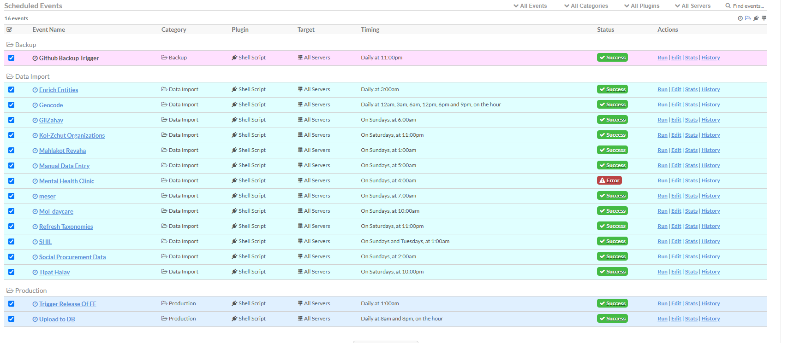

# Kol Sherut — ETL

The ETL is the data microservice of Kol Sherut. It collects social-service data from external
sources, curates it in Airtable, derives the search-ready dataset, and publishes it to
Elasticsearch — where the site's Search API reads from. Everything runs as scheduled jobs inside
a [Cronicle](https://github.com/jhuckaby/Cronicle) scheduler container.

## Documentation map

| Document | What it covers |
|----------|----------------|
| **[CRONICLE.md](CRONICLE.md)** | Operating the Cronicle scheduler: logging in, running and monitoring jobs, creating scheduled jobs, users, categories, and adding a new data fetcher |
| **[data.md](data.md)** (Hebrew) | Every data source: business description, link to the source in the world, and its spec file |

Deeper references live next to the code:
[`operators/publish/README.md`](data/plugins/srm-etl/operators/publish/README.md) (the publish pipeline),
[`operators/derive/README.md`](data/plugins/srm-etl/operators/derive/README.md) (legacy pipeline reference),
[`operators/deploy/README.md`](data/plugins/srm-etl/operators/deploy/README.md) (curated-fields sync),
and [`MIGRATION_STATUS.md`](data/plugins/srm-etl/MIGRATION_STATUS.md) (YAML-engine migration status).

## How the data flows

```
11 external sources ──▶ engine + specs ──▶ Airtable (Data Import base)
                                                 │  curation by the content team
                                                 ▼
                        geocode / taxonomy ──▶ Airtable (main base)
                                                 │
                                                 ▼
                            Upload to DB (publish/derive pipeline)
                                                 │
                                                 ▼
                          Elasticsearch (srm__cards, srm__autocomplete, …)
                                                 │
                                                 ▼
                                       Kol Sherut Search API
```

## Repository layout

```
ETL/
├── docker-compose.yml        # Cronicle + Elasticsearch for local development
├── dockerfile                # The Cronicle image with Python and the plugin code baked in
├── requirements.txt          # Python dependencies installed into the image
├── CRONICLE.md               # Scheduler operations guide
├── data.md                   # Data sources catalog (Hebrew)
└── data/
    ├── config.json           # Cronicle server configuration
    └── plugins/srm-etl/      # The ETL code, mounted/copied to /opt/cronicle/plugins/srm-etl
        ├── engine/           # Generic spec-driven fetcher engine (python -m engine <spec>)
        ├── specs/            # One YAML spec per external data source
        ├── operators/        # Non-fetcher jobs: publish, derive, deploy, geocode, taxonomy,
        │                     # manual_data_entry, github_backup, ssg_updater, backup, …
        ├── conf/             # settings.py — all environment variables are resolved here
        ├── srm_tools/        # Shared tooling (Airtable updater, logger, error notifier, …)
        └── transformers/     # Registered per-source transform ops used by the engine
```

### The two kinds of jobs

- **Data fetchers** — one generic engine (`python3 -m engine <spec_name>`) driven by a YAML spec
  per source in [`specs/`](data/plugins/srm-etl/specs). Adding a source means adding a spec file,
  not writing code. See [data.md](data.md) for the source list and
  [CRONICLE.md](CRONICLE.md#data-fetchers) for how to schedule one.
- **Operators** — Python packages under
  [`operators/`](data/plugins/srm-etl/operators), run as `python3 -m operators.<name>`:
  the publish/derive pipeline ("Upload to DB"), the taxonomy refresh, geocoding, manual data
  entry, the GitHub backup trigger, and the frontend release trigger.

## Environments

| Environment | Address | What runs there |
|-------------|---------|-----------------|
| **prod** | https://etl.kolsherut.org.il/ | Everything: all data fetchers, Upload to DB, taxonomy, geocode, backups, FE release trigger |
| **stage** | https://etl-staging.kolsherut.org.il/ | Only Upload to DB (the publish/derive pipeline) and the taxonomy refresh, against the staging stack |
| **dev** | https://etl-dev.kolsherut.org.il/ | Nothing scheduled — used for experiments |

The production schedule (16 events, split into the **Backup**, **Data Import**, and
**Production** categories):



## How a change ships

The ETL has two independent deploy routes, picked automatically from what a push touched
(see the `detect` job in [`deploy.yml`](../.github/workflows/deploy.yml)).

| You changed | Route | What happens |
|---|---|---|
| Anything under `data/plugins/srm-etl/` | **Plugins** | `sync-etl-plugins` syncs only the new and changed files to the environment's `etl-plugins` Azure File Share. No image build, no cluster start, no pod restart — Cronicle forks a fresh `python3` per job, so the next run picks up the change. Files deleted from the repo are removed from the share. |
| `dockerfile`, `requirements.txt`, `data/config.json` | **Image** | Full image rebuild, push to ACR, and `kubectl rollout restart`, exactly as before. Dev/stage clusters are started and stopped for it. |
| Both | Both | The plugins sync completes before the pod is restarted. |
| Anything else under `ETL/` (docs, tests) | **Image** | Falls back to a rebuild rather than deploying nothing. |

The plugin tree is mounted from the share over the copy the
[dockerfile](dockerfile) bakes into the image — one read-only bind mount per plugin
directory, so `/opt/cronicle/plugins/srm-etl` itself stays on the container's local disk
along with the scratch paths jobs write there (`gacache/`, `.checkpoints/`, `data/`,
`backup/`). The image copy is the seed for a brand-new or emptied share; once the share is
populated it is authoritative, and an image rebuild never reverts a plugin change.

Because the plugin directories are mounted read-only, the ETL sets
`PYTHONPYCACHEPREFIX=/tmp/pycache` (in [`Infra/values.yaml`](../Infra/values.yaml) under
`etl.env`) to keep CPython's `.pyc` cache off the share. Adding a new top-level plugin
directory means adding it to three places: the `COPY` lines in
[dockerfile](dockerfile), `etl.pluginsShare.mountedDirectories` in
[`Infra/values.yaml`](../Infra/values.yaml), and `PLUGIN_DIRECTORIES` in the
`sync-etl-plugins` job.

## Running locally

1. Create `data/plugins/srm-etl/.env` with the required variables (Airtable bases and API key,
   Elasticsearch connection, email notifier — see
   [`conf/settings.py`](data/plugins/srm-etl/conf/settings.py) for the full list).
2. Bring the stack up:

```bash
docker compose up --build
```

This starts Cronicle at http://localhost:3012 (admin credentials are set in
[docker-compose.yml](docker-compose.yml)) and a single-node Elasticsearch 7.17 at
http://localhost:9200. The plugin code is mounted read-write, so local edits are picked up
without rebuilding; rebuilding is only needed when `requirements.txt` or the dockerfile change.

> **Note:** the production Elasticsearch cluster must have the `analysis-icu` plugin installed —
> the Hebrew analyzer used by every index depends on it.
