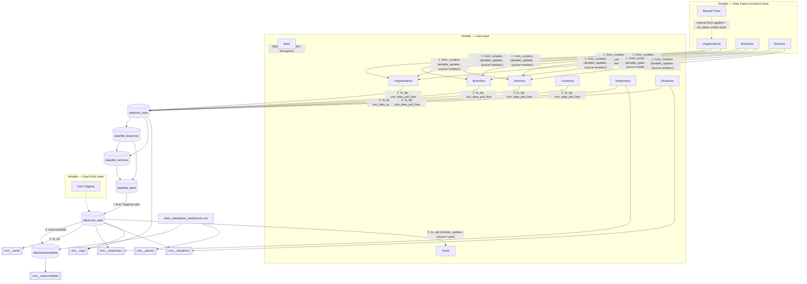

# The `derive` Operator — Full Reverse-Engineering Reference

> Target audience: developers who need to understand this operator **exactly** in order to rewrite it.
> Everything below was derived from reading the code in `operators/derive/`, the shared tooling in
> `srm_tools/`, the configuration in `conf/`, and the [dataflows](https://pypi.org/project/dataflows/)
> library (v0.5.5) it is built on.

> **Rewrite guidance:** anything that is commented out in the current code is dead and must
> **not** be carried over to the rewrite — just skip it. This includes the `to_mapbox` /
> `to_sitemap` stages, the SQL dumps in `to_sql.py` (`relational_sql_flow`, `dump_to_sql_flow`),
> the CKAN dumps in `stats.py`, and every other commented-out block mentioned in this document.
> Only the code that actually executes today defines the required behavior.

---

## 1. What it is

`derive` is the **last processing stage** of the SRM (Kol Sherut) ETL. All the upstream operators
(`entities`, `guidestar`, `soproc`, `meser`, `revaha`, `shil`, `geocode`, `manual_data_entry`, …)
collect and curate raw data into **Airtable** tables. The `derive` operator takes that curated
Airtable data and *derives* every artifact the application actually serves:

1. Clean, denormalized **datapackages** on local disk (`data/…`).
2. The **"cards"** dataset — one row per *(service, branch)* pair — which is the core unit the
   frontend displays.
3. An **autocomplete** query dataset.
4. Six **Elasticsearch indexes** (`srm__cards`, `srm__places`, `srm__responses`,
   `srm__situations`, `srm__orgs`, `srm__autocomplete`) that back the site's Search API.
5. A write-back of card summaries to the Airtable **Cards** table.

It runs identically in **staging and production** — there is *no environment branching in code*.
The environment is selected entirely by environment variables (see §3).

---

## 2. Entry points and orchestration

```
operators/derive/__init__.py
    deriveData()      # the real pipeline: runs the 5 stages in order
    operator()        # wraps deriveData with invoke_on(...) → failure e-mail + re-raise

operators/derive/__main__.py
    calls deriveData() directly  →  `python -m operators.derive` runs WITHOUT the e-mail wrapper
```

Stage order (each stage is a module with its own `operator()`):

| # | Module | Log banner | Purpose |
|---|--------|-----------|---------|
| 1 | `from_curation` | *Copying data from curation tables* | Sync the Data-Import (curation) Airtable base into the main Airtable base |
| 2 | `to_dp` | *Data Package Flow* | Pull the main base → build denormalized datapackages → build `card_data` |
| 3 | `autocomplete` | *AC Flow* | Generate autocomplete queries from `card_data` |
| 4 | `to_es` | *ES Flow* | Index everything into Elasticsearch |
| 5 | `to_sql` | *SQL Flow* | (misnomer — SQL dump is commented out) write card summaries back to Airtable `Cards` |

The whole thing is deployed as a job in a **Cronicle** scheduler container
(see `ETL/dockerfile` / `ETL/docker-compose.yml`; plugin code lives in
`/opt/cronicle/plugins/srm-etl`, and the process working directory is the plugin root — all
relative paths below are relative to it).

Two dead stages are commented out in `deriveData`: `to_mapbox` (Mapbox unused) and `to_sitemap`
(replaced by the backend).

### Failure handling

`operator()` → `invoke_on(deriveData, 'Upload to DB (Derive)')` (`srm_tools/error_notifier.py`):
on any exception it e-mails a stack trace to `EMAIL_NOTIFIER_RECIPIENT_LIST` with subject
`ETL Task - {ENV_NAME} : Upload to DB (Derive) Failed`, then re-raises.

---

## 3. Environments (staging vs production)

`conf/settings.py` reads everything from environment variables (`.env` via `python-dotenv`).
The code is environment-agnostic; these variables are what make a run "staging" or "production":

| Variable | Role in `derive` |
|----------|------------------|
| `ENV_NAME` | Only used in the failure e-mail subject |
| `ETL_AIRTABLE_BASE` → `settings.AIRTABLE_BASE` | The **main** Airtable base (read + written) |
| `ETL_AIRTABLE_DATA_IMPORT_BASE` → `AIRTABLE_DATA_IMPORT_BASE` | The **curation** base read by `from_curation` (also hosts `Manual Fixes`) |
| `ETL_AIRTABLE_DATAENTRY_BASE` → `AIRTABLE_DATAENTRY_BASE` | Hosts the `Auto Tagging` rules table |
| `DATAFLOWS_AIRTABLE_APIKEY` → `AIRTABLE_API_KEY` | Airtable token |
| `ES_HOST`, `ES_PORT`, `ES_HTTP_AUTH` | Which Elasticsearch cluster gets indexed |
| `EMAIL_NOTIFIER_*` | Failure notifications |

Fixed values in settings: `AIRTABLE_VIEW = 'Grid view'`, `DATA_DUMP_DIR = 'data'`, table names
(`Organizations`, `Branches`, `Services`, `Locations`, `Responses`, `Situations`, `Stats`,
`Cards`, `Manual Fixes`).

**Elasticsearch requirement:** the index mappings use a custom `hebrew` analyzer built on
`icu_tokenizer` / `icu_folding` / `icu_normalizer` — the cluster **must have the `analysis-icu`
plugin installed** (ES 7.17 in docker-compose; client pinned to `elasticsearch==7.13.4`).

---

## 4. dataflows in 60 seconds (what you must know to read this code)

`dataflows` processes streams of rows organized as *resources* (named tables) inside a
*datapackage* (Frictionless Data spec: a folder with `datapackage.json` + CSVs).

* `DF.Flow(step, step, …).process()` — executes the chain lazily, row-by-row. `.results()` also
  returns the data in memory as `(data, package, stats)`.
* A **step** can be: a standard processor (`DF.load`, `DF.join`, …), a *row* function
  (`lambda row: …`, mutates/returns one row), a *rows generator* (`def f(rows): yield …` —
  applied to **every resource** unless it filters by `rows.res.name`), a package-level function,
  a list of dicts (becomes a new resource), or `None` (**silently skipped** — used all over this
  code for conditional steps).
* `DF.load(path/datapackage.json, resources=[...])` — load resources from a dumped datapackage.
* `DF.dump_to_path(dir)` — write the current package to a folder.
* `DF.checkpoint(name)` — cache in `.checkpoints/<name>`; if the cache exists, all *preceding*
  steps are skipped on the next run. The operator `shutil.rmtree`s checkpoints at start to force
  fresh data.
* `DF.join(source, src_keys, target, tgt_keys, fields, mode)` — joins and **consumes** the source
  resource. Modes used here: `half-outer` (default), `inner`, `full-outer`.
  `DF.join_with_self(res, keys, fields)` — group-by + aggregate (`count`, `array`, `set`,
  `first`, `min`, …).
* `DF.add_field(name, type, default_or_lambda, **schema_extras)` / `DF.set_type(name, type=…,
  transform=…, **schema_extras)` — the `**schema_extras` (e.g. `{'es:keyword': True}`) are stored
  on the field descriptor and later consumed by the ES mapping generator (§9.4).
* `DF.sort_rows('{field}')` — sorts by the *string* rendering of the key template.
* `DF.finalizer(fn)` — run `fn` when the flow finishes.

Custom processors in `srm_tools`: `unwind(from_key, to_key)` (explode an array field → one row
per element) and the ones described in §9.

---

## 5. Data lineage overview



---

## 6. Stage 1 — `from_curation.py`

**Goal:** promote curated records from the Data-Import base into the main base, preserving
lifecycle status, applying manual fixes, and remapping cross-table record links.

`operator()` → `copy_from_curation_base(AIRTABLE_DATA_IMPORT_BASE, source_id='entities')`.

### 6.1 Snapshot + mark new records (per table: Organizations, Branches, Services)

For each of the three curation tables:

1. Delete local folder `from-curation-<Table>` and re-dump the full table into it
   (fields: the per-table `table_fields` + `decision`, Airtable record id, `status`, `id`,
   `source`, `fixes`, plus `extra_fields` — org: `services`/`branch_services`,
   branch: `services`/`org_services`, service: `organizations`/`branches`).
2. In the same flow, *after* the dump: rows whose `decision` is empty get `decision='New'`
   written **back to the curation base** (only `id` + `decision` are pushed). This flags
   never-reviewed records for the curation team. The local dump keeps the original (empty) value.

### 6.2 Promote each table into the main base

Each table is pushed through `airtable_updater` (§9.1) with `source_id='entities'`, reading from
the local dump (not Airtable again). Per-table fetch pipeline:

**Organizations** — filters (each records a Stats counter, §9.3):
`status == 'ACTIVE'` → `decision not in ('Rejected','Suspended')` → has `services` or
`branch_services`. Then `ManualFixes.apply_manual_fixes()` (§9.2), collect
`updated_orgs[curation_record_id] = logical id`, drop `source`/`status`, wrap with
`fetch_mapper`.

After the update, the main base Organizations table is re-read to build
`logical id → main-base record id`, and `updated_orgs` becomes
`curation record id → main-base record id`.

**Branches** — same status/decision filters + "has `services` or `org_services`". Additional
transforms: `location` (a plain location id string in the curation base) is wrapped into an
array and remapped through a `Locations`-table lookup (`location id → main-base record id`);
`organization` links are remapped from curation record ids to main-base record ids via
`filter_by_items(updated_orgs, …)` — **unmapped ids are silently dropped**; branches left with no
valid organization are filtered (stat). `updated_branches` mapping is collected and converted to
main-base record ids the same way as orgs.

**Services** — status/decision filters, manual fixes, then `organizations` and `branches` link
lists remapped through `updated_orgs` / `updated_branches`; kept only if ≥ 1 valid org **or**
branch (stat).

### 6.3 Finalize manual fixes

`ManualFixes.finalize()` writes each *referenced* fix's `etl_status`
(`Active` if it matched and was applied at least once, `Obsolete` otherwise) back to the
`Manual Fixes` table in the curation base, in batches of 50.

---

## 7. Stage 2 — `to_dp.py` (the heart of the operator)

`operator()` first deletes `.checkpoints/to_dp`, `.checkpoints/srm_raw_airtable_buffer`, and the
output dirs `data/{srm_data,flat_branches,flat_services,flat_table,card_data}`, then runs five
flows in order. (`sys.setrecursionlimit(5000)` is raised because deep `DF.Flow` chains recurse.)

### 7.1 `srm_data_pull_flow` → `data/srm_data`

Loads six tables from the **main** base (Responses, Situations, Organizations, Locations,
Branches, Services), checkpoints the raw snapshot (`srm_raw_airtable_buffer`), then runs the
`helpers.preprocess_*` cleaners (all in `helpers.py`; each renames the resource to lowercase,
drops `dummy` rows, and renames the Airtable record-id field to `key`):

* **responses / situations** — keep only `status=='ACTIVE'` (stat); `synonyms`: newline-split →
  tuple.
* **services** — active filter; `urls` `"href#title"` lines → `[{href,title}]` (default title
  `'קישור'`); `name` ← `name_manual` if set; `situation_ids` ← `situations_manual_ids` if set,
  else `situation_ids`; same for `response_ids` ← `responses_manual_ids`; `boost` → number
  (default 0); `phone_numbers` normalized (§7.1.1); `data_sources` newline-split; manual source
  columns deleted.
* **organizations** — active filter + "has name" filter (stats); urls/phones normalized;
  whitespace collapsed in `name`/`short_name`.
* **branches** — active filter; fixed field selection; urls/phones normalized; whitespace
  collapse on `name`.
* **locations** — no active filter. Adds `national_service` (accuracy == `'NATIONAL_SERVICE'`);
  drops rows with neither resolved nor fixed coordinates nor national flag (stats);
  `location_accurate` = accuracy ∈ `ACCURATE_TYPES`¹ or has fixed lat+lon; `lat`/`lon` prefer
  `fixed_*` over `resolved_*`; `geometry` = geopoint `[lon,lat]` (None for national);
  `address` = `resolved_address` or the location `id`.

¹ `ACCURATE_TYPES = (ROOFTOP, RANGE_INTERPOLATED, STREET_MID_POINT, ADDR_V1, ADDRESS_POINT, ADDRESS)`.

**7.1.1 Phone normalization** (`transform_phone_numbers`): per newline-separated entry, keep
digits; strip a `972` prefix (re-adding a leading `0`); format as `0X-XXX-XXXX` / `0XX-XXX-XXX` /
`1-XXX-XXX`; anything else is kept as the raw original string.

### 7.2 `flat_branches_flow` → `data/flat_branches`

One row per branch with its location and organization inlined:

1. Load `branches`, `locations`, `organizations` from `srm_data`.
2. Drop branches without a `location` link (stat); join location fields
   (`geometry`, `address`, `resolved_city`, `location_accurate`, `national_service`).
3. `address` = first of (resolved `address`, original branch address, `resolved_city`) that
   contains **no Latin letters** (`validate_address`).
4. Drop branches without an `organization` link (stat); **inner** join organization fields
   (name, short_name, description, purpose, kind, urls, phones, email, situations).
5. Rename everything to `branch_*` / `organization_*`; select a fixed column list.
6. **`merge_duplicate_branches`** — dedupe key = `hasher(organization_id, geometry-or-branch_id,
   branch_name)` (8-hex sha1). The first row wins; later duplicates merge into it field-by-field:
   `None` filled, lists unioned, differing strings only *warned* about when fuzzy similarity
   < 80 (`thefuzz`). Every old `branch_key` → merged key is recorded into **`branch_mapping`**
   (a plain dict passed by the caller — it links this flow to `flat_services_flow`). Also
   computes `organization_branch_count` (unique branches per org).

### 7.3 `flat_services_flow` → `data/flat_services`

Explodes services × branches:

1. Load `flat_branches` (streamed first) + `services` (from `srm_data`).
2. `collect_branches` — while `flat_branches` streams through, record
   `branch_key → branch_id` and the subset of non-national branches.
3. `unwind('organizations' → 'organization_key')` — one service row per linked org.
4. Join `flat_branches` on `organization_key`, aggregating
   `organization_branches = set(branch_key)` (all branches of the org).
5. Direct `branches` links are remapped through `branch_mapping` (dedup-aware); unknown keys drop.
6. `organization_branches` filtered by **`filter_soproc_branches`**: for `soproc:*` services with
   > 5 org branches, if the org has any branch whose id starts with `national` — keep *only*
   those; otherwise (and for all other services) keep only non-national branches.
7. `merge_branches` = sorted union of direct + org branches; `unwind` → **one row per
   (service, branch_key)**.
8. Rename to `service_*`, select fixed columns, dump.

### 7.4 `flat_table_flow` → `data/flat_table`

Inner-join each `(service, branch_key)` row with its `flat_branches` row (all `branch_*` /
`organization_*` columns), add `branch_short_name` (org short name or org name), **dedupe** on
`(service_id, branch_id)`, set that pair as primary key, dump. This is the API-backing flat table.

### 7.5 `card_data_flow` → `data/card_data`

Two passes. In-memory lookups are pre-built from `srm_data`: `situations` and `responses`
dicts keyed **both** by Airtable `key` and by taxonomy `id` → `{id, name, synonyms}`.

**Pass A (checkpointed as `to_dp`):**

1. Load `flat_table` → resource `card_data`; `card_id = hasher(branch_id, service_id)`.
2. **`merge_duplicate_services`** — rows sorted so services with `service_implements` come first.
   An org that "implements" X registers `found[org_id] ∋ X`. For a later row of the same org:
   skip if its `service_id` occurs inside any implemented value, or if it's a `soproc:` service
   (generic procured service superseded by the org's own curated one).
3. `situation_ids` = union of service + branch + organization situations, then:
   `normalize_taxonomy_ids` (split comma/space-smashed ids, canonicalize singular
   `human_situation:` → `human_situations:`, drop bare-root tokens, dedupe) →
   `map_taxonomy` (keep only ids known to the Situations table, mapped to canonical `id`) →
   `fix_situations`: drop the gender pair when *both* men+women present; always drop
   `hebrew_speaking`; auto-add `arabic_speaking` when `sectors:arabs` or `sectors:bedouin`.
4. `response_ids` = service responses mapped through the Responses lookup.
5. **`apply_auto_tagging`** (`autotagging.py`) — rules from the Data-Entry base `Auto Tagging`
   table: each rule = query string + flags (match in org name / org purpose / service name) +
   situation/response ids to add. A field matches if it **ends with** the query or contains
   `query + ' '`. Added ids are also recorded in `auto_tagged` (used by the RS score).
6. Drop cards with no `response_ids` (stat + `cards-no-responses` report).

**Pass B (from the checkpoint):**

1. Materialize `situations` / `responses` arrays of `{id,name,synonyms}` objects.
2. **RS score** (`RSScoreCalc`) — a distinctiveness score per card:
   * From all cards: `freq(situation, response)` co-occurrence counts;
     `score(s,r) = ln(total(r) / freq(s,r))` (an IDF: rarer situation-for-this-response ⇒ higher).
   * Per card: each situation's score = Σ over the card's responses of `score(s,r)/|responses|`,
     forced to **0 for auto-tagged** situations. Situations are re-sorted by score (desc);
     while the total exceeds `MAX_SCORE = 30`, the highest-scoring situations are dropped
     (over-tagged cards lose their most "exotic" tags). Result stored in `rs_score`,
     `situation_scores`, and the trimmed `situations`/`situation_ids`.
3. `situation_ids_parents` / `response_ids_parents` — every id expanded with all its taxonomy
   ancestors (≥ 2 segments); matching `situations_parents` / `responses_parents` object arrays.
4. `response_categories` = segment #1 of each response id (malformed ids logged + skipped);
   `response_category` = most common; cards without one are dropped (stat); `responses` reordered
   so the main category comes first.
5. Drop cards whose `branch_geometry` is outside Israel's bounding box
   (lon 33–37, lat 29.3–33.3) unless `national_service` (stat + `cards-invalid-location` report).
6. Derived presentation fields:
   * `possible_autocomplete` — phrase variants (response, situation, "X עבור Y", "X בcity", …)
     skipping `IGNORE_SITUATIONS`² and age_group/language situation names.
   * `point_id` — geometry serialized to a fixed-width string (or `national_service`); used to
     group cards at the same map point.
   * `national_service_details` = `'ארצי'` when national; `coords` = `"[lon,lat]"` string.
   * `collapse_key` = `service_name + ' ' + service_description` (ES collapse/dedup key).
   * `address_parts` `{primary, secondary}` — fuzzy-locates the city inside the address
     (`regex` with ≤ 2 errors), splits street vs city, appends `' (במיקום לא מדויק)'` when the
     location isn't accurate; national → `primary='שירות ארצי'`.
   * `organization_original_name` preserved; `organization_name`/`short_name` cleaned by
     `clean_org_name` (strips legal suffixes בע"מ/ע"ר/חל"צ and stop-words עמותת/העמותה ל);
     `organization_name_parts` `{primary, secondary}` — short name + remainder of full name;
     `organization_resolved_name` = `[branch_operating_unit]` if set else
     `[short_name, name]`.
7. Log a count of `meser-s-` cards, set `card_id` as primary key, validate, dump.

² `IGNORE_SITUATIONS = {human_situations:language:hebrew_speaking, human_situations:age_group:adults}`.

Throughout, `**KEYWORD_ONLY` / `**KEYWORD_STRING` / object-schema kwargs attach `es:*` hints for
the ES mapping (§9.4).

---

## 8. Stages 3–5

### 8.1 `autocomplete.py` → `data/autocomplete`

Loads `card_data` and explodes each card through 10 Hebrew query **templates**, in importance
order (index = `importance`): `{response}`, `{situation}`, `{response} עבור {situation}`,
`{org_name}`, `{response} של {org_name}`, `{org_id}`, `{response} ב{city_name}`,
`שירותים עבור {situation} ב{city_name}`, `{response} עבור {situation} ב{city_name}`,
`{response} של {org_name} ב{city_name}`.

For every combination (uses `responses_parents`/`situations_parents`, i.e. ancestors included;
org names try operating unit, short name, name, original name):

* **Skips:** ignored situations²; situations with < 3 taxonomy segments (except a 7-item
  whitelist of important 2-level ones); `org_id` not matching `^(srm|)[0-9]+$`; city names that
  are not purely Hebrew; any query where a `None` leaked into the text.
* **`low` flag** (⇒ score 0.5): the response/situation is only an ancestor (not directly on the
  card), or the org has < 5 branches.
* `visible = False` for the `{org_id}` template (search-only, not shown).
* `structured_query` = space-joined unique set of names + synonyms + city + org (stop-words
  עבור/של/באיזור removed). `query_heb` = query with org id replaced by org name.

Then: sort by importance → `join_with_self` on `query` (count of duplicates → `score`, first
values for the rest, `low` = min ⇒ *not-low if any instance was direct*) →
`score = (ln(count)+1)²`, overridden to `0.5` if `low` → **bounds**: `city_name` fuzzy-matched
(≥ 80) against `static_data/place_data/data/places.csv` (1,430 places, names + bbox).
⚠️ A query whose city fails to match is **dropped the first time** but *kept with `bounds=None`
on subsequent occurrences* (the `None` is cached — inconsistent behavior, see §11). Finally
`id` = alphanumeric tokens of the query joined by `_`, dump.

### 8.2 `to_es.py` — Elasticsearch indexing

Deletes `.checkpoints/to_es` and `data/{response_data,situation_data}`, then runs six flows.
All use `dump_to_es_and_delete` (§9.4) — a zero-downtime "revision swap" full reindex.

| Flow | Index | Source | Notes |
|------|-------|--------|-------|
| `data_api_es_flow` | `srm__cards` | `data/card_data` | Adds `score` = **card_score** (below) and `airtable_last_modified` = max(service, branch). Rich `es:*` typing (taxonomy objects, non-indexed contact fields, keyword ids, date format). |
| `load_locations_to_es_flow` | `srm__places` | static `places.csv` | Place names + bounds + score, pk `key`. |
| `load_responses_to_es_flow` | `srm__responses` | `card_data` + Airtable Responses | Counts cards per response id (ancestors included), joins onto the Responses table, keeps ACTIVE rows with count ≥ 1; `score = count`; also dumps `data/response_data`. |
| `load_situations_to_es_flow` | `srm__situations` | same pattern for situations | dumps `data/situation_data`. |
| `load_organizations_to_es_flow` | `srm__orgs` | `srm_data` orgs + `card_data` | Cards per org; joins name/description/kind; `score = 10 × count`, pk `id`. |
| `load_autocomplete_to_es_flow` | `srm__autocomplete` | `data/autocomplete` | pk `id`. A second flow re-loads 10k rows and does nothing (vestigial CKAN dump). |

**`card_score`** (ES relevance base): start 1; ×10 if not a `meser-` service; ×10 if description
longer than 5 chars; if national: ×10, and ×5 again if the first phone number is short (≤ 5) or
starts with `1` (hotline); else multiply by `branch_count/10` (if > 100) or `√branch_count`;
×5 if org kind ∈ {משרד ממשלתי, רשות מקומית, תאגיד סטטוטורי}; finally × `10^service_boost`.

### 8.3 `to_sql.py` — Cards write-back (misnomer)

The actual SQL dump (`dump_to_sql` to `DATASETS_DATABASE_URL`) and the relational dump are
**commented out**. What runs is `cards_to_at_flow()`: `airtable_updater` (§9.1) pushes, per
`card_id`, the fields `organization_id, service_id, branch_id, situation_ids, response_ids,
service_boost, organization_branch_count, branch_location_accurate` into the main base **Cards**
table with `source='card'` (full status management: vanished cards → INACTIVE).

---

## 9. Shared machinery

### 9.1 `srm_tools/update_table.py :: airtable_updater(table, source_id, fields, fetch_flow, update_flow)`

The universal "sync into Airtable" primitive:

1. Load the target table, keep only rows with `source ∈ {source_id, 'dummy'}` → resource
   `current`; compute `_current_hash` over `fields + source + status` (whitespace-stripped).
2. Run `fetch_flow` → resource `fetched` with exactly `{id, data}` rows (`fetch_mapper` builds
   these; `data` = all fetched fields).
3. `full-outer` join `current` into `fetched` on `id` (old rows missing from the fetch survive
   with `data=None`). `status = 'ACTIVE' if data else 'INACTIVE'`; `source = source_id`.
4. `update_flow` (`update_mapper`) spreads `data` into the row's real columns.
5. `test_hash` keeps **only new or changed rows** (hash comparison) — minimizes Airtable writes.
6. `dump_to_airtable` (typecast on) upserts by the Airtable record id.

### 9.2 `manual_fixes.py :: ManualFixes`

Loads the curation base `Manual Fixes` table (record id → `{field, current_value,
fixed_value}`); if a referenced fix id isn't found it reloads once *without* the view filter,
then raises `AssertionError`. `apply_manual_fixes()` — for each fix id in a row's `fixes` links:
if the row's current field value equals the fix's `current_value` (or `current_value == '*'`),
set `row[field] = fixed_value` and mark the fix `Active`, else leave the row and mark the fix
`Obsolete`. For `responses`/`situations` fields, values are compared as normalized sorted
comma-joined id sets. `finalize()` writes `etl_status` back (§6.3).

### 9.3 `srm_tools/stats.py :: Stats / Report`

`Stats.filter_with_stat(name, predicate, …)` filters rows *and* counts the removed ones, then
**immediately writes the count as a row in the main base `Stats` Airtable table** (one Airtable
API write per stat, mid-flow). Optional `Report` collects the dropped rows' key fields —
but `Report.save()`'s CKAN dump is commented out, so reports are currently **discarded**.

### 9.4 `es_utils.py :: dump_to_es_and_delete` + `SRMMappingGenerator`

* Connects with retries; **if `ping()` fails it prints `FAILED TO CONNECT TO ES` and returns
  `None`** — the flow then runs *without* the dump step (silent skip; the pipeline "succeeds"
  without indexing — see §11).
* Adds a `revision` field (one random uuid per call) to every row, `dump_to_es`
  (mapping via `SRMMappingGenerator`, index settings define the `hebrew` ICU analyzer), then a
  finalizer sleeps 30 s and `delete_by_query`s all docs whose `revision` differs — i.e. docs
  are upserted in place by primary key and leftovers from the previous run are purged.
* `SRMMappingGenerator` maps the `es:*` field hints (from `es_schemas.py` and inline kwargs):
  `es:keyword` → `keyword`, `es:autocomplete` → `search_as_you_type`, `es:index: False` →
  unindexed, `es:hebrew` **or a field name ending** in `name/purpose/description/details/
  synonyms/heb` → adds a `.hebrew` text subfield with the `hebrew` analyzer; `es:schema`
  describes nested object fields; `es:itemType` types array items.

### 9.5 Small utilities

`hasher(*args)` = first 8 hex chars of sha1 (branch/card ids — collision-tolerant assumption);
`unwind` (§4); `clean_org_name` (§7.5-B6); `fetch_mapper`/`update_mapper` (§9.1).

---

## 10. Complete side-effects inventory

**Airtable writes**

| Base | Table | Writer | What |
|------|-------|--------|------|
| Data Import | Organizations/Branches/Services | `from_curation` | `decision='New'` on undecided rows |
| Data Import | Manual Fixes | `ManualFixes.finalize` | `etl_status` Active/Obsolete |
| Main | Organizations/Branches/Services | `from_curation` via `airtable_updater` | upsert with `source='entities'`, status management |
| Main | Stats | every `filter_with_stat` | one counter row per named stat |
| Main | Cards | `to_sql` via `airtable_updater` | card summaries, `source='card'`, status management |

**Elasticsearch** — full revision-swap reindex of `srm__cards`, `srm__places`, `srm__responses`,
`srm__situations`, `srm__orgs`, `srm__autocomplete`.

**Local filesystem** (under the plugin working directory)

* `from-curation-{Organizations,Branches,Services}/` — curation snapshots (recreated each run)
* `.checkpoints/{srm_raw_airtable_buffer, to_dp, to_es/…}` — deleted at stage start
* `data/{srm_data, flat_branches, flat_services, flat_table, card_data, autocomplete,
  response_data, situation_data}` — the derived datapackages (deleted at stage start)

**E-mail** — failure notification (only when run through `operator()`, not `__main__`).

---

## 11. Known quirks & tech-debt (inputs for the rewrite)

1. **Silent ES skip** — if Elasticsearch is unreachable, `dump_to_es_and_delete` returns `None`
   and the run "succeeds" without indexing anything (§9.4). No alert fires.
2. **`to_sql` is a misnomer** — the SQL dump is dead code; the stage only writes to Airtable.
3. **`get_bounds` inconsistency** — first occurrence of an unknown city is dropped; subsequent
   occurrences are emitted with `bounds=None` (§8.1).
4. **Stats = one Airtable write per stat, mid-stream** — slow, rate-limit-prone, and stats from
   aborted runs are already half-written. `Report` output is silently discarded (CKAN dump
   commented out).
5. **Airtable is both the source and a sink** across stages (read-modify-write of the same
   tables); a crash mid-`airtable_updater` leaves a table partially updated with mixed statuses.
6. **`__main__.py` bypasses the error notifier** — `python -m operators.derive` sends no failure
   e-mail; `operator()` does.
7. **Duplicated logic** — `places.csv` loaded twice (`autocomplete.py`, `to_es.py`);
   `safe_reorder_responses_by_category` in `to_dp.py` duplicates
   `helpers.reorder_responses_by_category` (the helpers version is dead — see §12).
8. **Dead code / vestiges** — `to_mapbox`/`to_sitemap` (removed stages), commented CKAN dumps,
   the second no-op autocomplete flow in `to_es`, unused `dataflows_ckan` imports, the giant
   commented field list in `to_sql`.
9. **`sys.setrecursionlimit(5000)`** — a workaround for very deep `DF.Flow` chains.
10. **Fragile cross-flow coupling** — `branch_mapping` (a mutable dict threaded through two
    flows), `collect_branches`/`collect_ids` relying on dataflows' resource streaming order,
    and `filter_by_items` mutating link lists in place.
11. **`print` vs `logger`** used interchangeably; debug prints (`FIXING NEWS`, `UPDATED ORGS`,
    `BRANCH MAPPING…`) in production paths.
12. **RS-score trimming drops the *highest*-scoring situations** of over-tagged cards
    (sorted desc + `pop(0)`), which is intentional-looking but worth a product decision review.
13. **Full-snapshot processing** — every run re-reads all Airtable tables and fully reindexes ES;
    `_current_hash`/`test_hash` minimizes Airtable writes, but there is no incrementality
    anywhere else.
14. **Hidden infra requirement** — the ES `analysis-icu` plugin (§3); index settings/mappings are
    created implicitly by `tableschema-elasticsearch` from the `es:*` hints scattered across
    the code.

---

## 12. Verified dead-code inventory (do not port to the rewrite)

Every item below was verified by searching the **entire plugin** for callers (other operators do
import from `derive` — e.g. `geocode` uses `helpers.ACCURATE_TYPES`, `manual_data_entry` uses
`autocomplete.VERIFY_ORG_ID`, `presets` uses `es_utils.dump_to_es_and_delete` — so those are
*not* dead). Together with the commented-out code (see the rewrite-guidance note at the top),
none of the following should be carried over.

### 12.1 Live code whose output nobody consumes (runs on every production run)

| Where | What | Why it's dead |
|-------|------|---------------|
| `to_dp.py:634` + `helpers.calculate_branch_short_name` | `branch_short_name` computed in `flat_table_flow` | Its entry in the very next `select_fields` list is commented out (`to_dp.py:678`), so the field is dropped immediately |
| `to_dp.py:646-647` | `'response_key'`, `'situation_key'` in the flat_table `select_fields` list | No upstream flow ever creates these fields (leftover from an older pipeline shape); dataflows silently ignores missing names |
| `manual_fixes.py` | `fetch_aux_table()` + `self.responses` / `self.situations` in `__init__` | Their only consumers were the `extra_field = 'response_ids'/'situation_ids'` blocks in `apply_manual_fixes`, which are commented out |
| `to_es.py:111-129` | `HEB` regex + `select_text_fields()` | Defined, referenced by no flow (old ES full-text extractor) |
| `to_es.py:277-281` | Second flow in `load_autocomplete_to_es_flow` (loads 10k rows, sets pk, no sink) | Vestige of a removed CKAN dump — burns time on every run for nothing |
| `to_dp.py` / `srm_tools/stats.py` | The `Report` objects (`cards-no-responses`, `cards-invalid-location`) still collect rows | `Report.save()`'s CKAN dump is commented out → the collected reports are discarded |
| `to_dp.py`, `to_es.py` | Checkpoints `srm_raw_airtable_buffer` and `to_es/data_api_es_flow` | Written every run, deleted at the start of the next run, loaded by nothing — pure I/O overhead (only aids manual debugging re-runs) |

### 12.2 Defined but never called anywhere in the plugin

| Where | What |
|-------|------|
| `to_sql.py:26` | `dump_to_sql_flow()` — its only call site is commented out |
| `helpers.py:272-303` | `point_offset_table()` + `POINT_OFFSETS` + `generate_offset()` — the "spread up to 7 map points" feature (srm-etl issue #8); `POINT_OFFSETS` is even computed at import time |
| `helpers.py:110-121` | `reorder_responses_by_category` / `reorder_records_by_category` — superseded by the local `safe_reorder_responses_by_category` in `to_dp.py` |
| `es_schemas.py:46` | `AUTOCOMPLETE_STRING` — no users; `autocomplete.py` inlines the same hint |

### 12.3 Unused imports

* `to_dp.py:19` — `from operators.derive import manual_fixes` (manual fixes run in
  `from_curation`, not `to_dp`)
* `autocomplete.py:11`, `to_es.py:9` — `from dataflows_ckan import dump_to_ckan`
* `helpers.py:4` — `ResourceMatcher`
* `srm_tools/stats.py:4` — `dump_to_ckan` (its usage is commented out)
