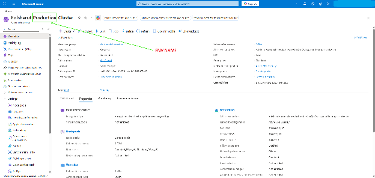

# Azure Environments — Operations Guide

How to reach, start/stop and reconfigure each Kolsherut environment on Azure. Written for **every team member**, not only developers — nothing here requires a terminal.

Everything runs in the `kolzchutIL.onmicrosoft.com` tenant, subscription `ea11628f-a9ed-4397-bacb-b9a541a77c62`, one resource group per environment. You need an Azure account in that tenant with access to the relevant resource group.

## Table of Contents

- [Environments at a glance](#environments-at-a-glance)
- [Starting and stopping a cluster](#starting-and-stopping-a-cluster)
- [Frontend configuration](#frontend-configuration)
  - [Where configuration lives](#where-configuration-lives)
  - [Editing a config file](#editing-a-config-file)
  - [Rules to remember](#rules-to-remember)
- [Related documentation](#related-documentation)

## Environments at a glance

| Environment | Resource group | AKS cluster | Site | Backend | ETL |
| --- | --- | --- | --- | --- | --- |
| **Production** | `Kolsherut-Production` | [Kolsherut-Production-Cluster][aks-prod] | [www.kolsherut.org.il](https://www.kolsherut.org.il) | [be.kolsherut.org.il](https://be.kolsherut.org.il) | [etl.kolsherut.org.il](https://etl.kolsherut.org.il) |
| **Staging** | `Kolsherut-Staging` | [Kolsherut-Stage-Cluster][aks-stage] | [staging.kolsherut.org.il](https://staging.kolsherut.org.il/) | [be-staging.kolsherut.org.il](https://be-staging.kolsherut.org.il/) | [etl-staging.kolsherut.org.il](https://etl-staging.kolsherut.org.il/) |
| **Development** | `Kolsherut-Development` | [Kolsherut-Development-Cluster][aks-dev] | [dev.kolsherut.org.il](https://dev.kolsherut.org.il/) | [be-dev.kolsherut.org.il](https://be-dev.kolsherut.org.il/) | [etl-dev.kolsherut.org.il](https://etl-dev.kolsherut.org.il/) |

Frontend configuration is edited in the **[Kolsherut-FE-Configurations][fe-config-repo]** GitHub repository (see [below](#frontend-configuration)). The file shares it syncs to, for reference only — do not edit them by hand:

| Environment | Storage account | Share | Portal link |
| --- | --- | --- | --- |
| **Production** | `feproductionaccount` | `frontend` | [open][share-prod] |
| **Staging** | `festagingaccount` | `frontend` | [open][share-stage] |
| **Development** | `fedevaccount` | `frontend` | [open][share-dev] |

Which environment a Git branch or release deploys to is described in the root README's [CI CD](../README.md#ci-cd) section.

## Starting and stopping a cluster

Dev and staging clusters are **stopped when idle** to save cost; the deploy workflow starts them for the duration of a deploy and stops them again ([details](../README.md#ci-cd)). Production is always on.

Start a cluster manually when you want to use dev/staging outside a deploy (QA, demos, checking a config change).

1. Open the cluster's portal link from the table above.
2. Confirm the page title reads `Kolsherut-<ENV NAME>-Cluster` for the environment you intended — the three overview pages look identical otherwise.

   

3. **To start:** click **Start**. The cluster takes a few minutes to come up; the site answers once all pods are running.
4. **To stop:** click **Stop**, wait a few minutes, then refresh the page. The cluster is stopped when **Stop** is greyed out and **Start** is active (blue), as in the screenshot above.

Rules:

- **Never stop production.**
- If you started dev or staging by hand, **stop it when you are done** — the deploy workflow leaves a manually started cluster running, so nothing else will stop it for you.
- Starting a cluster while a deploy is running is harmless; stopping it mid-deploy will fail that deploy.

## Frontend configuration

### Where configuration lives

The frontend Docker image is fully static (nginx + the built `dist/`). Each environment additionally has an **Azure File Share** mounted into the frontend pod, so two folders are served from the share instead of from the image:

| Folder on the share | Served at | Content | Written by |
| --- | --- | --- | --- |
| `configs/` | `/configs/*.json` | the runtime configuration files (`config.json`, `strings.json`, `filters.json`, …) | the **[Kolsherut-FE-Configurations][fe-config-repo]** repository — a commit to `main` mirrors the environment folder onto the share automatically |
| `p/` | `/p/**` | the SSG-generated pages (tens of thousands of `index.html` files) | the deploy pipeline — wiped and re-copied from the image on every pod start |

**The configuration repository — not Azure and not this repository — is the source of truth for the config files a running environment serves.** Nobody edits files on the share by hand any more: the sync from the repository is a full mirror with deletions, so a manual edit in the Azure Portal is overwritten (and a manually added file deleted) on the next sync.

The repository has one folder per environment:

| Folder | Environment | Site |
| --- | --- | --- |
| [`dev/`][fe-config-dev] | Development | [dev.kolsherut.org.il](https://dev.kolsherut.org.il/) |
| [`stage/`][fe-config-stage] | Staging | [staging.kolsherut.org.il](https://staging.kolsherut.org.il/) |
| [`production/`][fe-config-prod] | Production | [www.kolsherut.org.il](https://www.kolsherut.org.il) |

Each folder holds the same files that are documented in [FE/README.md → Configuration Files](../FE/README.md#configuration-files). You need write access to the configuration repository on GitHub (ask a team lead).

The Kubernetes wiring is in the Helm chart: [`Infra/templates/fe-deployment.yaml`](../Infra/templates/fe-deployment.yaml) (the `sync-config` initContainer and the two `volumeMounts`), [`fe-storage.yaml`](../Infra/templates/fe-storage.yaml) / [`fe-pvc.yaml`](../Infra/templates/fe-pvc.yaml) (static PV/PVC bound to the share) and `frontend.persistence` in [`Infra/values.yaml`](../Infra/values.yaml). The initContainer only adds config files that are **missing** from the share (`cp -rn`); it never overwrites an existing one.

### Editing a config file

Everything happens in the browser on GitHub — no terminal, no Azure Portal.

1. Open the environment folder in the [configuration repository][fe-config-repo] (table above). Double-check the folder name: `dev/`, `stage/` or `production/`.
2. Click the file you need (see the FE README for what each file controls), then the **pencil icon** (Edit this file).
3. Make the change. Keep the JSON valid — see the rules below.
4. Click **Commit changes…**:
   - **Dev / staging:** *Commit directly to the `main` branch* is fine.
   - **Production:** choose *Create a new branch and start a pull request*, and have someone review before merging. Pull requests run JSON validation only; nothing reaches the share until the merge.
5. Once the commit is on `main`, the **Sync Configurations To Azure File Shares** workflow (repository → **Actions** tab) validates all JSON files and mirrors the changed environment folder(s) onto the share. It takes about a minute; a red run means nothing was synced — open it to see which file failed validation.
6. Open the site for that environment and refresh. The frontend fetches config files with a cache-buster on every load, so a browser refresh is enough — no restart, no deploy.

Need to apply the same change to several environments? Edit the file in each folder (one commit can touch several folders — only the folders that changed are synced).

**Force a re-sync** (e.g. after a cancelled run or if the share looks wrong): **Actions** → *Sync Configurations To Azure File Shares* → **Run workflow** → pick an environment or `all`.

### Rules to remember

- **Never edit config files in the Azure Portal.** They will be overwritten by the next sync. The share links in the table at the top are for looking, not editing.
- **Valid JSON only.** A trailing comma or a missing quote makes `loadConfig` fail and the site shows the **maintenance page** for everyone. CI blocks the sync on invalid JSON, but test on dev or staging first anyway.
- **Test on dev/staging before production.** Production changes go through a pull request.
- **`environment.json` is per environment** — it points the frontend at that environment's backend. Do not copy it between folders.
- **Defaults still live in this repository.** [`FE/public/configs/`](../FE/public/configs/) is what a *brand-new* environment starts with, and the initContainer re-adds any file that exists in the image but is missing from the share. So:
  - a change to `FE/public/configs/` does **not** reach an existing environment — make it in the configuration repository too;
  - to **delete** a config file for good, remove it from both the configuration repository and `FE/public/configs/`, otherwise the next pod restart restores it and the next sync deletes it again;
  - when adding a **new** config file, add it to the configuration repository folders *and* to `FE/public/configs/` if the frontend should ship it by default.
- **Never edit `p/`.** It is SSG output and is overwritten on every pod start; the sync never touches it.
- A stopped dev/staging cluster does not serve the site, but the share is always writable — a synced change is live when the cluster starts.

## Related documentation

- [Root README → CI CD](../README.md#ci-cd) — which branch deploys where, and how the workflow starts/stops clusters.
- [Kolsherut-FE-Configurations][fe-config-repo] — the configuration repository and its sync workflow.
- [FE/README.md → Configuration Files](../FE/README.md#configuration-files) — what every config file controls.
- [FE/README.md → SSG](../FE/README.md#2-ssg--build-time-pre-rendering) — how the `p/` pages are generated.
- [Infra/DEPLOYMENT.md](../Infra/DEPLOYMENT.md) — deploying the Helm chart by hand.

[fe-config-repo]: https://github.com/kolzchut/Kolsherut-FE-Configurations
[fe-config-dev]: https://github.com/kolzchut/Kolsherut-FE-Configurations/tree/main/dev
[fe-config-stage]: https://github.com/kolzchut/Kolsherut-FE-Configurations/tree/main/stage
[fe-config-prod]: https://github.com/kolzchut/Kolsherut-FE-Configurations/tree/main/production
[aks-prod]: https://portal.azure.com/#@kolzchutIL.onmicrosoft.com/resource/subscriptions/ea11628f-a9ed-4397-bacb-b9a541a77c62/resourceGroups/Kolsherut-Production/providers/Microsoft.ContainerService/managedClusters/Kolsherut-Production-Cluster/overview
[aks-stage]: https://portal.azure.com/#@kolzchutIL.onmicrosoft.com/resource/subscriptions/ea11628f-a9ed-4397-bacb-b9a541a77c62/resourceGroups/Kolsherut-Staging/providers/Microsoft.ContainerService/managedClusters/Kolsherut-Stage-Cluster/overview
[aks-dev]: https://portal.azure.com/#@kolzchutIL.onmicrosoft.com/resource/subscriptions/ea11628f-a9ed-4397-bacb-b9a541a77c62/resourceGroups/Kolsherut-Development/providers/Microsoft.ContainerService/managedClusters/Kolsherut-Development-Cluster/overview
[share-prod]: https://portal.azure.com/#view/Microsoft_Azure_FileStorage/FileShareMenuBlade/~/browse/storageAccountId/%2Fsubscriptions%2Fea11628f-a9ed-4397-bacb-b9a541a77c62%2FresourceGroups%2FKolsherut-Production%2Fproviders%2FMicrosoft.Storage%2FstorageAccounts%2Ffeproductionaccount/path/frontend/protocol/SMB
[share-stage]: https://portal.azure.com/#view/Microsoft_Azure_FileStorage/FileShareMenuBlade/~/browse/storageAccountId/%2Fsubscriptions%2Fea11628f-a9ed-4397-bacb-b9a541a77c62%2FresourceGroups%2FKolsherut-Staging%2Fproviders%2FMicrosoft.Storage%2FstorageAccounts%2Ffestagingaccount/path/frontend/protocol/SMB
[share-dev]: https://portal.azure.com/#view/Microsoft_Azure_FileStorage/FileShareMenuBlade/~/browse/storageAccountId/%2Fsubscriptions%2Fea11628f-a9ed-4397-bacb-b9a541a77c62%2FresourceGroups%2FKolsherut-Development%2Fproviders%2FMicrosoft.Storage%2FstorageAccounts%2Ffedevaccount/path/frontend/protocol/SMB
