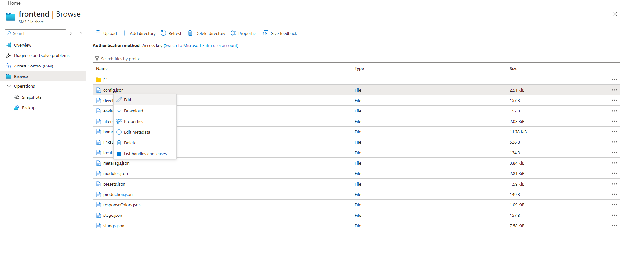
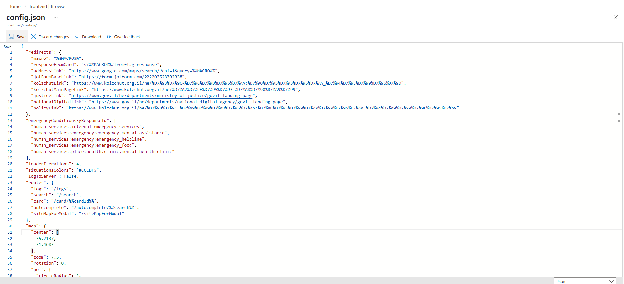

# Azure Environments — Operations Guide

How to reach, start/stop and reconfigure each Kolsherut environment on Azure. Written for **every team member**, not only developers — nothing here requires a terminal.

Everything runs in the `kolzchutIL.onmicrosoft.com` tenant, subscription `ea11628f-a9ed-4397-bacb-b9a541a77c62`, one resource group per environment. You need an Azure account in that tenant with access to the relevant resource group.

## Table of Contents

- [Environments at a glance](#environments-at-a-glance)
- [Starting and stopping a cluster](#starting-and-stopping-a-cluster)
- [Frontend configuration on the file share](#frontend-configuration-on-the-file-share)
  - [Why the share exists](#why-the-share-exists)
  - [What lives on the share](#what-lives-on-the-share)
  - [Editing a config file](#editing-a-config-file)
  - [Rules to remember](#rules-to-remember)
- [Related documentation](#related-documentation)

## Environments at a glance

| Environment | Resource group | AKS cluster | Site | Backend | ETL |
| --- | --- | --- | --- | --- | --- |
| **Production** | `Kolsherut-Production` | [Kolsherut-Production-Cluster][aks-prod] | [www.kolsherut.org.il](https://www.kolsherut.org.il) | [be.kolsherut.org.il](https://be.kolsherut.org.il) | [etl.kolsherut.org.il](https://etl.kolsherut.org.il) |
| **Staging** | `Kolsherut-Staging` | [Kolsherut-Stage-Cluster][aks-stage] | [staging.kolsherut.org.il](https://staging.kolsherut.org.il/) | [be-staging.kolsherut.org.il](https://be-staging.kolsherut.org.il/) | [etl-staging.kolsherut.org.il](https://etl-staging.kolsherut.org.il/) |
| **Development** | `Kolsherut-Development` | [Kolsherut-Development-Cluster][aks-dev] | [dev.kolsherut.org.il](https://dev.kolsherut.org.il/) | [be-dev.kolsherut.org.il](https://be-dev.kolsherut.org.il/) | [etl-dev.kolsherut.org.il](https://etl-dev.kolsherut.org.il/) |

Frontend file shares (see [below](#frontend-configuration-on-the-file-share)):

| Environment | Storage account | Share | Portal link |
| --- | --- | --- | --- |
| **Production** | `feproductionaccount` | `frontend` | [open][share-prod] |
| **Staging** | `festagingaccount` | `frontend` | [open][share-stage] |
| **Development** | `fedevaccount` | `frontend` | [open][share-dev] |

Which environment a Git branch or release deploys to is described in the root README's [CI CD](../README.md#ci-cd) section.

## Starting and stopping a cluster

Dev and staging clusters are **stopped when idle** to save cost; the deploy workflow starts them for the duration of a deploy and stops them again ([details](../README.md#ci-cd)). Production is always on.

Start a cluster manually when you want to use dev/staging outside a deploy (QA, demos, checking a config change).

1. Open the cluster's portal link from the table above.
2. Confirm the page title reads `Kolsherut-<ENV NAME>-Cluster` for the environment you intended — the three overview pages look identical otherwise.

   

3. **To start:** click **Start**. The cluster takes a few minutes to come up; the site answers once all pods are running.
4. **To stop:** click **Stop**, wait a few minutes, then refresh the page. The cluster is stopped when **Stop** is greyed out and **Start** is active (blue), as in the screenshot above.

Rules:

- **Never stop production.**
- If you started dev or staging by hand, **stop it when you are done** — the deploy workflow leaves a manually started cluster running, so nothing else will stop it for you.
- Starting a cluster while a deploy is running is harmless; stopping it mid-deploy will fail that deploy.

## Frontend configuration on the file share

### Why the share exists

The frontend Docker image is fully static (nginx + the built `dist/`). Each environment additionally has an **Azure File Share** mounted into the frontend pod, so two folders are served from the share instead of from the image:

| Folder on the share | Served at | Content | Synced on every pod start by |
| --- | --- | --- | --- |
| `configs/` | `/configs/*.json` | the runtime configuration files from [`FE/public/configs/`](../FE/public/configs/) | `cp -rn` — **new files are added, existing files are never overwritten** |
| `p/` | `/p/**` | the SSG-generated pages (tens of thousands of `index.html` files) | wipe + full copy from the image (**the share is always overwritten**) |

The wiring is in the Helm chart: [`Infra/templates/fe-deployment.yaml`](../Infra/templates/fe-deployment.yaml) (the `sync-config` initContainer and the two `volumeMounts`), [`fe-storage.yaml`](../Infra/templates/fe-storage.yaml) / [`fe-pvc.yaml`](../Infra/templates/fe-pvc.yaml) (static PV/PVC bound to the share) and `frontend.persistence` in [`Infra/values.yaml`](../Infra/values.yaml). The account name, key and share name per environment come from the secrets values files.

Because `configs/` is copied only when a file is missing, **the share — not the repo — is the source of truth for the config files a running environment actually serves.** This lets a non-developer change a text, a filter or a colour on a live environment without a build, but it also means a config change committed to Git does **not** reach an environment where that file already exists on the share. See the rules below.

### What lives on the share

Browse the share (links in the table above) → `configs/`. You will find the same files that are documented in [FE/README.md → Configuration Files](../FE/README.md#configuration-files): `config.json`, `strings.json`, `filters.json`, `responseColors.json`, `metaTags.json`, `modules.json`, `presets.json`, `homepage.json`, `linksBelow.json`, `jsonLd.json`, the per-environment files and `environment.json`.

The `p/` folder is the SSG output. Do not edit it by hand — it is rebuilt by the deploy pipeline and overwritten on every frontend pod restart.

### Editing a config file

1. Open the share link for the environment you want to change (table above). Check the breadcrumb says the right storage account (`fedevaccount` / `festagingaccount` / `feproductionaccount`).
2. Open the `configs/` folder.
3. Find the file you need (see the FE README for what each file controls).
4. Right-click the file (or use its `…` menu) → **Edit**.

   

5. Make the change in the inline editor and click **Save**.

   

6. Open the site for that environment and verify. The frontend fetches config files with a cache-buster on every load, so a browser refresh is enough — no restart, no deploy.

### Rules to remember

- **Change configs in two places.** Whenever you change a config file in the repo (`FE/public/configs/*.json`), apply the same change on the share of every environment that should receive it. The repo change only reaches environments where the file does not exist on the share yet (i.e. a brand-new file). The reverse also holds: a change made only on the share is lost if someone recreates the share, and it will drift from Git — so mirror share edits back into the repo.
- **Valid JSON only.** A trailing comma or a missing quote makes `loadConfig` fail and the site shows the **maintenance page** for everyone. Validate before saving, and test on dev or staging first.
- **`environment.json` is per environment** — it points the frontend at that environment's backend. Do not copy it between shares.
- **Never edit `p/`.** It is SSG output and is overwritten on every pod start.
- A stopped dev/staging cluster does not serve the site, but the share is always available — you can edit configs while the cluster is off and they will be live when it starts.

## Related documentation

- [Root README → CI CD](../README.md#ci-cd) — which branch deploys where, and how the workflow starts/stops clusters.
- [FE/README.md → Configuration Files](../FE/README.md#configuration-files) — what every config file controls.
- [FE/README.md → SSG](../FE/README.md#2-ssg--build-time-pre-rendering) — how the `p/` pages are generated.
- [Infra/DEPLOYMENT.md](../Infra/DEPLOYMENT.md) — deploying the Helm chart by hand.

[aks-prod]: https://portal.azure.com/#@kolzchutIL.onmicrosoft.com/resource/subscriptions/ea11628f-a9ed-4397-bacb-b9a541a77c62/resourceGroups/Kolsherut-Production/providers/Microsoft.ContainerService/managedClusters/Kolsherut-Production-Cluster/overview
[aks-stage]: https://portal.azure.com/#@kolzchutIL.onmicrosoft.com/resource/subscriptions/ea11628f-a9ed-4397-bacb-b9a541a77c62/resourceGroups/Kolsherut-Staging/providers/Microsoft.ContainerService/managedClusters/Kolsherut-Stage-Cluster/overview
[aks-dev]: https://portal.azure.com/#@kolzchutIL.onmicrosoft.com/resource/subscriptions/ea11628f-a9ed-4397-bacb-b9a541a77c62/resourceGroups/Kolsherut-Development/providers/Microsoft.ContainerService/managedClusters/Kolsherut-Development-Cluster/overview
[share-prod]: https://portal.azure.com/#view/Microsoft_Azure_FileStorage/FileShareMenuBlade/~/browse/storageAccountId/%2Fsubscriptions%2Fea11628f-a9ed-4397-bacb-b9a541a77c62%2FresourceGroups%2FKolsherut-Production%2Fproviders%2FMicrosoft.Storage%2FstorageAccounts%2Ffeproductionaccount/path/frontend/protocol/SMB
[share-stage]: https://portal.azure.com/#view/Microsoft_Azure_FileStorage/FileShareMenuBlade/~/browse/storageAccountId/%2Fsubscriptions%2Fea11628f-a9ed-4397-bacb-b9a541a77c62%2FresourceGroups%2FKolsherut-Staging%2Fproviders%2FMicrosoft.Storage%2FstorageAccounts%2Ffestagingaccount/path/frontend/protocol/SMB
[share-dev]: https://portal.azure.com/#view/Microsoft_Azure_FileStorage/FileShareMenuBlade/~/browse/storageAccountId/%2Fsubscriptions%2Fea11628f-a9ed-4397-bacb-b9a541a77c62%2FresourceGroups%2FKolsherut-Development%2Fproviders%2FMicrosoft.Storage%2FstorageAccounts%2Ffedevaccount/path/frontend/protocol/SMB
